# MEISHAV  
## 1. START
### 1.1 Project    
Design of a reconfigurable multi-core heterogeneous processor utilising RISC-V architecture.   
 
<div align=center>  
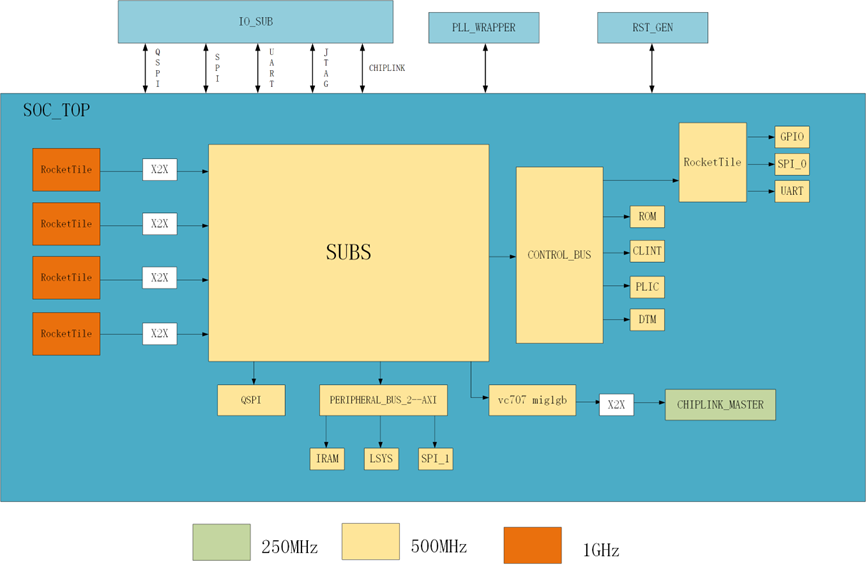      

Design Architecture
<div>
<div align=left><div> 
 
#### Memory Map
Base | Size（B） | Description | Notes|
:-----------: | :-----------: | :-----------: | :-----------:|
0x0000_0000 | 4K | debug-controller | 
0x0000_3000 | 4K | error-device | 
0x0001_0000 | 8K | Mask ROM (32 KiB) | 
0x0200_0000 | 64K | CLINT |  
0x0C00_0000 | 4M | PLIC |  
0x5000_0000 | 0x6000_0000(256M) | PCIE HOST 空间 |  
0x5000_0000 | 512K | on chip sram |  
0x5100_0000 | 4K | soc_lsys |  
0x5200_0000 | 4K | spi_1 |  
0x6000_0000 | 0x6400_0000 | TIMEOUT |  
0x20_0000_0000 | 0x20_0800_0000/128M | pci ctrl 空间 timeout |  
0x20_0800_0000 | 0x20_1000_0000 | TIME_OUT |  
0x20_1000_0000 | 0x21_000_0000 | TIME_OUT |  
0x21_0000_0000 | 0x3F_FFFF_FFFF | TIME_OUT |  
0x6400_0000 | 4K | serial | 不支持narrow，sparse
0x6400_1000 | 4K | spi_0 | 不支持narrow，sparse
0x6400_2000 | 4K | gpio | 不支持narrow，sparse
0x8000_0000 | 512M | CHIPLINK | 
0xA000_0000 | 512M | DDR（SDRAM） |  
0xC000_0000 | 1G | TIME_OUT | 注意到这段空间不允许访问，访问会导致总线挂死
MIG_CHIPLINK_SLAVE | 1 MIG真实空间0x8000_0000 - 0xC000_0000可remap到如下空间：0x1000_*0000 - 0xE000_0000*（13*256=3328M） | 1 slave口需要地址remap，最高4bit可以控制，连接到SOC_LSYS，默认最高4bit改成1 | 集成chiplink到meishav100版本，用于后续验证[https://g-ntwx0319.coding.net/p/v100/assignments/issues/32/detail](https://g-ntwx0319.coding.net/p/v100/assignments/issues/32/detail)
### 1.2 Background  
The demand for artificial intelligence computing power in unmanned systems has surged significantly, rendering traditional isomorphic computing systems inadequate for the requirements. Multi-core heterogeneous processors have garnered substantial attention due to their formidable computing capabilities. Simultaneously, RISC-V, as a fully open-source instruction set architecture, empowers us to design our own CPUs entirely.   

###  1.3 Goal  
Design a dispatch chip for unmanned systems with high performance and rich peripherals. At the same time, the chip also has reconfigurable characteristics, that is,appropriate CPU and peripheral configurations can be chosen according to different upper-layer applications to improve computational efficiency.     

<div align=center>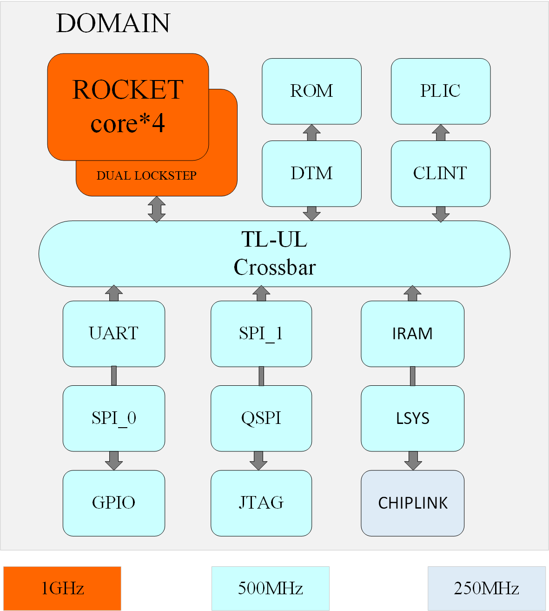  

Standalone Chip  
  
<div>
<div align=left><div>   

## 2. Hardware    
<div align=center>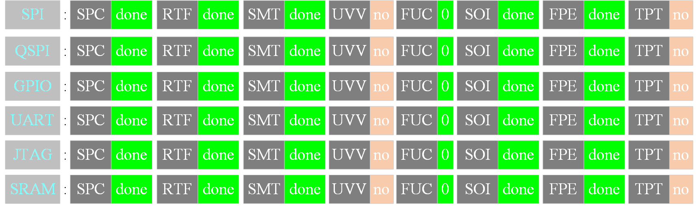  
Completion
<div>
<div align=left><div>        

The table below provides a list of the hardware modules we currently possess:    
  
| Design | Spec Version |
| :---: | :---: |
| GPIO | 1.1.0 |
| SPI | 1.1.0 |
| QSPI | 1.1.0 |
| UART | 1.1.0 |
| JTAG | 1.1.0|  
|SRAM|1.1.0|


+ The chip incorporates GPIO peripherals, which facilitate bidirectional communication with the external environment.
+ The chip features two SPIs and one QSPI, supporting both single-wire and four-wire modes, and is employed for communication with external devices, such as SD cards.
+ The chip includes a UART peripheral, which implements dual-lane full-duplex UART functionality.
+ The chip houses a JTAG port. By interfacing with the JTAG pins, the logic within the debug module enables the core to enter debug mode, affording the ability to inject code either into the device—through instruction emulation—or directly into memory. 
### 2.1 GPIO  
#### 2.1.1 GPIO Technical Specification  

##### Description
The GPIO module facilitates software communication through general-purpose I/O pins with a high degree of flexibility. Each of the 32 individual bits can be configured as peripheral outputs using two distinct modes. Similarly, each of these 32 bits can be accessed by software as peripheral inputs. The connectivity of these peripheral inputs and outputs to the chip's I/O pins is beyond the scope of this document. Refer to the Comportability Specification for detailed peripheral I/O options at the top chip level.

In the output configuration, this module offers direct 32-bit access to each GPIO value via direct write functionality. This mode empowers software to control all GPIO bits simultaneously. Alternatively, the module supports masked writes, which allow software to update half of the bits at once, enabling the modification of a subset of the output values without necessitating a read-modify-write sequence. In this mode, the user specifies a mask indicating which of the 16 bits are to be altered, along with their new values. Detailed operation of this mode is elucidated in the Programmers Guide.

For input operations, software can read the status of any GPIO peripheral input. Additionally, software can configure interrupt events for any of the 32 bits, with options including positive edge, negative edge, or level detection. A noise filter can be enabled for any of the 32 GPIO inputs, requiring the input to remain stable for 16 module clock cycles before the input register acknowledges the change and evaluates interrupt generation. It is important to note that if the filter is activated and the pin is designated as an output, there will be a corresponding delay in reflecting output changes in the input register.

For in-depth insights into output, input, and interrupt control mechanisms, please consult the Design Details section.
##### Features
- 32 General Purpose Input/Output (GPIO) ports
- Configurable interrupt capability for each GPIO, supporting rising edge, falling edge, or active low/high input detection
- Dual methods for updating GPIO output: direct write and masked (thread-safe) update   
  
#### 2.1.2 Theory of Operation    
##### 2.1.2.1 GPIO Output
The GPIO module maintains a single 32-bit output register, DATA_OUT, with two methods of write access. Direct write access utilizes DIRECT_OUT, while masked write access employs MASKED_OUT_UPPER and   
  
MASKED_OUT_LOWER. Direct access allows full read and write capabilities for all 32 bits within one register.

For masked access, the bits to be modified are specified as a mask in the upper 16 bits of the MASKED_OUT_UPPER and MASKED_OUT_LOWER register writes, with the data to be written provided in the lower 16 bits of the register write. The hardware updates DATA_OUT according to this mask, enabling modifications without requiring software to perform a Read-Modify-Write operation.

Reads from masked registers return the lower or upper 16 bits of the DATA_OUT contents, with zeros returned in the upper 16 bits (mask field). To read the values on the pins, software should access the DATA_IN register. (Refer to the GPIO Input section below).

This same concept is applied to the output enable register, DATA_OE. Direct access uses DIRECT_OE, and masked access is facilitated through MASKED_OE_UPPER and MASKED_OE_LOWER. The output enable is transmitted to the pad control block to determine whether the pad should drive the DATA_OUT value to the associated pin.

A typical usage pattern involves initializing and suspending/resuming code utilizing the full access registers to set the output enables and current output values, before switching to masked access for both DATA_OUT and DATA_OE.

For GPIO outputs that are not in use (either not connected to a pin output or not selected for pin multiplexing), the output values are disconnected and have no impact on the GPIO input, regardless of the output enable settings.

##### 2.1.2.2 GPIO Input
The DATA_IN register provides the contents as observed on the peripheral input, usually from the pads connected to these inputs. In the presence of a pin-multiplexing unit, GPIO peripheral inputs not connected to a chip input will be tied to a constant zero input.

The GPIO module offers optional independent noise filter control for each of the 32 input signals. Each input can be independently enabled with the CTRL_EN_INPUT_FILTER (one bit per input). This 16-cycle filter is applied to both the DATA_IN register and the interrupt detection logic. The timing for DATA_IN remains non-instantaneous if CTRL_EN_INPUT_FILTER is false due to top-level routing, but no flops are present between the chip input and the DATA_IN register.

The contents of DATA_IN are always readable and reflect the value seen at the chip input pad, irrespective of the output enable setting from DATA_OE. If the output enable is true (and the GPIO is connected to a chip-level pad), the value read from DATA_IN includes the effect of the peripheral's driven output (thus differing from DATA_OUT only if the output driver is unable to switch the pin or during the delay imposed if the noise filter is enabled).

##### 2.1.2.3 Interrupts
The GPIO module provides 32 interrupt signals to the main processor. Each interrupt can be independently enabled, tested, and configured. Following the standard interrupt guidelines in the Comportability Specification, the 32 bits of the INTR_ENABLE register determine whether the associated inputs are configured to detect interrupt events. If enabled via the various INTR_CTRL_EN registers, their current state can be read in the INTR_STATE register. Clearing is achieved by writing a 1 into the associated INTR_STATE bit field.

For configuration, four types of interrupts are available per bit, controlled with four control registers. INTR_CTRL_EN_RISING configures the associated input for rising-edge detection. Similarly, INTR_CTRL_EN_FALLING detects falling edge inputs. INTR_CTRL_EN_LVLHIGH and INTR_CTRL_EN_LVLLOW allow the input to be level-sensitive interrupts. Theoretically, an input can be configured to detect both rising and falling edges, but there is no hardware assistance to indicate which edge caused the output interrupt.

**Note #1**: The interrupt can only be triggered by GPIO input. **Note #2**: All inputs are subject to optional noise filtering before being sent into interrupt detection. **Note #3**: All interrupts to the processor are level interrupts as per the Comportability Specification guidelines. The GPIO module, if configured, converts an edge detection into a level interrupt to the processor core.


### 2.2 UART    
#### 2.2.1 UART Technical Specification   

##### Description
UART is a universal serial data bus designed for asynchronous communication. The bidirectional nature of the bus facilitates full-duplex transmission and reception. UART operates by transmitting data bits one by one. Typically, three wires are utilised to complete the communication: the transmission line (TX), the reception line (RX), and the ground line (GND). The TX and RX of both parties must be cross-connected, while the GND can be connected for normal communication.     
##### Features
+ 2-pin full-duplex external interfaces
+ 8-bit data word, optional even or odd parity bit per byte
+ 1 stop bit
  
+ <font color=black>32 x 8b RX buffer(不知道我们UART buffer的深度是不是32) </font>
+ <font color=black>32 x 8b TX buffer(不知道我们UART buffer的深度是不是32) </font>
+ Programmable baud rate
#### 2.2.2 Theory of Operation    
##### Communication Protoco  
During idle periods, the TX/RX serial lines maintain a high state. Data transmission commences with a START bit, when the high idle state transitions from 1 to 0, followed by 8 data bits. The least significant bit is transmitted first. If the parity feature is enabled, an odd or even parity bit is inserted after the data bits. Conclusively, a STOP bit, maintained at logic 1, signifies the completion of one byte of data transfer.  


<div align=center>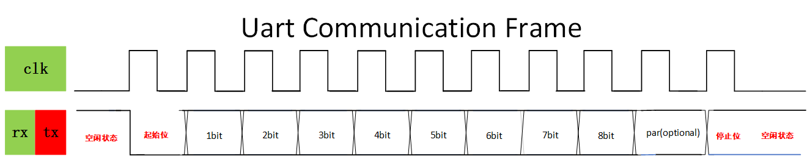  


  
<div>
<div align=left><div>    
 
##### Transmission  
Writing to `WDATA`register enqueues a data byte into the 32-byte deep write FIFO, thereby triggering the transmit module to initiate UART TX serial data transfer. The TX module dequeues the byte from the FIFO and shifts it bit by bit onto the UART TX pin on the positive edges of the baud clock.  

In the event that TX is not enabled, data written into the FIFO will be accumulated and transmitted once TX is enabled.

Upon the FIFO becoming empty as part of the transmission process, a TX FIFO done interrupt will be generated when the final byte has completed transmission. This interrupt is distinct from the TX FIFO watermark interrupt.  
##### Reception  
The RX module oversamples the RX input pin at 16 times the requested baud rate. Upon detecting a low state on the input, the receiver verifies that the line remains low half a bit-time later  to confirm the START bit. If the line returns to a high state, the potential glitch is disregarded. After identifying the START bit, the RX module samples at the center of each bit-time, collecting incoming serial bits into a character buffer. If the STOP bit is detected as high and the optional parity bit is correct, the data byte is enqueued into the 32-byte deep RX FIFO. The data can then be retrieved by reading the `RDATA` register.
#### 2.2.3 Design Verification      
##### Goals 
###### DV
Verify UART IP features by running dynamic simulations with a SV/UVM based testbench  
##### Design features  
For detailed information on UART design features, please see the **UART Technical Specification**.   
##### Testbench architecture  
###### Top level testbench  
Top level testbench is located at /trunk/hw/d2dv100_top/dv/dut_MEISHAV100_TOP_wrapper.sv. It instantiates the TOP DUT module /trunk/hw/d2dv100_top/rtl/top/MEISHAV100_TOP.sv. In addition, it instantiates the following interfaces, connects them to the DUT and sets their handle into `uvm_config_db`:  
+  Clock and reset interface  
+  Tilelink host interface  
+  UART IOs  
##### Global types & methods  
All common types and methods defined at the package level can be found in `uart_env_pkg`    
##### TL_agent  
UART instantiates `tl_agent` which provides the ability to drive and independently monitor random traffic via TL host interface into UART device.
##### UART_agent
`UART agent` is used to drive and monitor UART items, which also provides basic coverage on data, parity, baud rate etc. These baud rates are supported: 9600, 115200, 230400, 1Mbps(1048576), 2Mbps(2097152)
#### 2.2.3.1 Testplan  
This validation environment encompasses a substantial amount of supplementary code; however, the parent classes may introduce anomalies or superfluous functionalities. Consequently, it is permissible to directly alter the inherited parent class to the corresponding UVM base class, as necessitated
##### 2.2.3.1.1 Develop an agent
In the environment written this time, `uart`, as `slave_agent`, is driven by soc, so uart_agent only contains a driver, which is used to collect signals from the uart port during the test.
###### uart_agent_cfg.sv
The baud rate, parity check bit and other attributes of uart are defined, and a uart interface is declared for monitor to collect data. There are 7 functions in this file, which are:`set_uart_period_glitch_pct、get_uart_period_glitch_pct、set_baud_rate、set_parity、set_max_drift_cycle_pct、get_max_drift_cycle_pct、reset_asserted、reset_deasserted`.
###### uart_agent_pkg.sv
The library and files used by uart_agent are imported, and some enumerated variables are defined, such as BaudRate(baud rate), transmission direction (single, dual, quad), etc., which is convenient for us to use.
###### uart_agent.sv

A `uart_monitor` and `uart_agent_config` are defined, `uart_if` as set in `config_db` is passed to` cfg.uart_if`, and `uart_cfg` is set to the database.
###### uart_driver.sv
The `uart_driver` class inherits from `dv_base_driver` and is used to drive transmission and receive operations in the simulation environment of UART. It is responsible for getting the data item `uart_item` from the sequencer and driving it to the UART interface. This class mainly simulates the receiving process of data by controlling the received signal of the UART interface`uart_rx`.  

###### Main tasks and functions:   
`run_phase`:  
`run_phase` is one of the UVM simulation phases, in which the driver first calls the `reset_signals` method to reset the UART interface signal, and then enters the` get_and_drive`task, continuously fetching data from the sequencer and driving the transmission.     

`reset_signals`:   
This task is used to reset the UART received signal (' uart_rx ') to ensure that the signal is in a known state at the start of the simulation.
`set_rx` :
The `set_rx` task is responsible for setting the value of the received signal (`uart_rx`) of the UART, while randomly introducing some small amplitude signal failures (usually 10% of the clock cycle) according to the configuration. This function is used to simulate the signal jitter and faults that may exist in real hardware, so as to test the fault tolerance of the system to these abnormal conditions.    

`get_and_drive`:  
This task takes the data item (`uart_item`) from the sequencer (`seq_item_port`) and drives it to the UART interface based on the information in the configuration and request.  
If parity is enabled (`en_parity`) or the parity configuration is overridden in the request (` ovrd_en_parity`), it transmits all data bits including the parity bits to the 'uart_rx' signal.
This task also handles the situation during a reset, and if a reset signal is detected, the currently transmitted data item is abandoned.    

`wait_uart_rx_cycle`:  
The `wait_uart_rx_cycle` task is used to wait for the next clock cycle when the UART receives a signal. This can be done by waiting for the callback function (`drv_rx_cb`) in the simulation environment or by detecting the reset signal.
The task monitors the reset signal or UART clock event through the `fork` mechanism and chooses to end the current cycle based on the simulation.

###### uart_if.sv
The uart interface provides data for the monitor. Contains the 2 basic signals of uart and some signals for debugging.
###### uart_item.sv
The `uart_item` class is a UVM class that inherits from `uvm_sequence_item` and represents the basic data unit that is transferred in UART communication. This class defines the basic structure of a UART packet, including the start bit, stop bit, data, parity and other information, and provides some constraints and methods to control the randomization and use of these fields.

###### uart_monitor.sv
`tx_analysis_port`and `rx_analysis_port` are used to collect data transmitted and received by the UART respectively and to pass this data to the `scoreboard` for further analysis and verification.
###### Main tasks and functions: 
`collect_tx_data`：  
This task monitors the UART transmission signal (`uart_tx `) and collects data for each transmission. When `uart_tx` is low and `tx_monitor` is enabled, the data collection process begins.    

The collection process consists of getting the start bit, the data bit, the check bit (if enabled), and finally the stop bit. Each bit is collected via a callback function of the monitor interface.
After the collection is complete, the task checks whether the check bit is correct and passes the collected data to the tx_analysis_port for further analysis by the scoreboard.    

`collect_rx_data`：  
This task monitors the UART reception signal (`uart_rx`) and collects data on each reception. Similar to the `collect_tx_data`task, data collection begins when `uart_rx` is low and `rx_monitor` is enabled.  
The collection process consists of getting the start bit, the data bit, the check bit (if enabled), and finally the stop bit. The collection of each bit is also done through the callback function of the monitor interface.  
After the collection is complete, the task checks whether the check bit is correct and passes the collected data to the rx_analysis_port for further analysis by the scoreboard.  
`drive_tx_clk` and `drive_rx_clk`:
  
`drive_tx_clk`and`drive_rx_clk`are used to drive the transmission and reception of the clock signal of the UART, respectively, to ensure that the data is collected within the correct clock cycle.    

`mon_tx_stable`:    
The `mon_tx_stable` task is responsible for monitoring the stability of the UART transmitted signal and checking whether the signal remains stable for a specified clock period.    

`process_reset`:   
`process_reset` are used to reset the UART. During the reset, data collection is stopped. After the reset is complete, the data collection process is restarted.  

###### uart_logger.sv
The uart_logger class is a UVM component that inherits from the uvm_component and is used to capture the log data transferred from the UART and store it in a log file or print it in a simulation log.
###### uart_base_agent.core
`.core `file is the configuration file that fusesoc uses to manage the project and can copy other written files and then make changes to several parts.  
##### 2.2.3.1.2 Develop an env
###### uart_scoreboard.sv
Define four queues to store the expected and actual write data and read data. The expected data is obtained from the tl-agent, and the actual data is obtained from the uart-agent. Retrieve the uart data using `uvm_blocking_get_port` and compare the expected data with the actual data. However, the current scoreboard has some problems and is not used in the current validation environment.

###### uart_env.sv
`uart_agent, uart_agent_cfg, uart_scoreboard, and uvm_tlm_analysis_fifo` (connecting uart_scoreboard and uart_monitor) are defined.
###### uart_env_pkg.sv
The libraries and files used by uart_env are imported.
###### uart_base_env.core
The configuration file for uart_env, which provides dependencies for uart_test.  
##### 2.2.3.1.3 Develop an sequence
###### seq_lib.sv
Base sequence of uart. The current environment uses uart_item in the agent folder that is the same as this sequence. Therefore, this file is not used currently.
##### 2.2.3.1.4 Develop an test
###### uart_test.sv
The test is modified by referring to the tl-test written in the environment.
###### uart_macros.svh
The register base address and offset of uart are defined for our convenience.

###### uart_test.v
Refer to `tlul_test.sv` to write, mainly to change the `main_phase` code. The rest just defines a `uart_if` in `uart_base_test_cfg` and a `uart_env` in `uart_base_test`. 
###### UART interface definition：  
The uart_if interface is defined in the `uart_base_test_cfg` for communicating with the UART environment.  
The UART environment is initialized：  
Initialize the `uart_env` environment in uart_base_test, which is responsible for configuring and monitoring the behavior of the UART.  
###### Register configuration：  
In `main_phase`, data is written to the register of the UART mainly through the TileLink (TL) protocol agent (`TL-agent `) to complete the register configuration. Compared with the Register Abstraction layer (RAL), TL-agent can interact with hardware more directly and is suitable for lower-level verification scenarios.
  
Use TL-agent to configure UART control registers, including `DIV`, `TXCTRL`, `RXCTRL` and so on.
After the configuration, the TL-agent writes the generated data to `uart_txfifo`.
#### 2.2.4 Hardware Interfaces    
The following table shows the uart connection method:  
|Master_Port|Slave_Port|  
|:-:|:-:|  
|Master_Tx|Slave_Rx|  
|Master_Rx|Slave_Tx|   
|GND|GND|     

The following diagram shows the system block diagram of UART：   
   
  
<div align=center>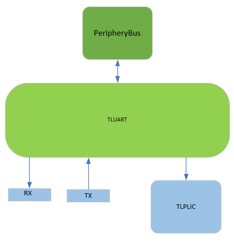  

Block Diagram
  
<div>
<div align=left><div>   

#### 2.2.5 Registers  
##### Control Register       
A serial port control register is a specialized type of register within communication interfaces, responsible for managing the configuration and control of serial communication lines. These registers are essential for facilitating and overseeing data transfers between devices that employ serial communication protocols.
offset | Name | Description
:-----------: | :-----------: | :-----------:|
0x00 | txdata | Transmit data register
0x04 | rxdata | Receiver data register
0x08 | txctrl | Transmit control register
0x0C | rxctrl | Receive control register
0X10 | ie | UART interrupt enable
0X14 | ip | UART interrupt pending
0X18 | div | Baud rate divisor      

 The functions typically managed by these registers include:
##### Baud Rate Divisor Register(div)  
It determines the speed of data transmission in bits per second (baud). The div register designates the divisor employed for the baud rate generation of the Tx and Rx channels. The input clock is derived from the bus clock. The reset value of the register is configured to div_init, and, given the anticipated frequency of the tlclk, it is calibrated to yield a 115200 baud output upon reset.  

|tlclk (MHz) | Target Baud (Hz) | Divisor | Actual Baud (Hz) | Error (%)|   
|:-----------:| :-----------: | :-----------:| :-----------:| :-----------:
|500 | 31250 | 16000 | 31250 | 0|  
|500 | 115200 | 4340 | 115207 | 0.0064|
|500 | 250000 | 2000 | 250000 | 0|
|500 | 1843200 | 271 | 1845018 | 0.099|
|750 | 31250 | 24000 | 31250 | 0|
|750 | 115200 | 6510 | 6510 | 0.0064|
|750 | 250000 | 3000 | 3000 | 0|
|750 | 1843200 | 407 | 407 | 0.024 | 
##### Transmit Data Register (txdata)  
If the FIFO is capable of accepting a new entry, then writing to the txdata register queues the characters contained within the data field to the transmitting FIFO. Reading from txdata returns the current value of the full flag and sets the data field to zero. The full flag signifies whether the transmitting FIFO can accommodate the new entry. Post-setting, writes to the data field are disregarded. 
**Bits** | **Field Name** | **Attr.**
:-----------: | :-----------: | :-----------:
[7:0] | data | RW
[30:8] | Reserved |  
31 | full | RO  

##### Receive Data Register (rxdata)
The read rxdata register extracts a character from the received FIFO and returns its value in the data field. The empty flag indicates whether the received FIFO is devoid of contents. Upon being set, the data field does not contain valid characters. Writes to rxdata are ignored.

**Bits** | **Field Name** | **Attr.**
:-----------: | :-----------: | :-----------:
[7:0] | data | RW
[30:8] | Reserved |  
31 | full | RO
##### Interrupt Registers (ip and ie)
The ip register is a read-only register that indicates pending interrupt conditions, while the read-write ie register controls which UART interrupts are enabled. ie was reset to 0.
**Bits** | **Field Name** | **Attr.**  
:-----------: | :-----------: | :-----------:  
0 | txwm | RW  
1 | rxwm | RW  
[31:2] | Reserved |  
#### 2.2.6 Checklist
##### Design Checklist    
|Type|Item|Resolution|    
|:-:|:-:|:-:|
|Documentation|UART SPEC|Done|  
|RTL|Design|Done|    

##### Verification Checklist 
|Type|Item|Resolution|    
|:-:|:-:|:-:|
|Documentation|VIP|Done|  
|RTL|Design|Done|  
### 2.3 SPI    
#### 2.3.1 SPI Technical Specification    

#####  Description  
The SPI controller supports single-, dual-, and quad-channel protocols in host-only mode. The baseline controller provides a FIFO-based interface for executing programmed input/output operations. Software initiates transfers by queuing frames into the transmit FIFO; upon completion, the slave responses are placed in the receive FIFO.

Additionally, the dedicated SPI0 controller implements an SPI flash read sequencer, which exposes the contents of an external SPI flash as a read-only/execute memory-mapped device. Given an input clock rate below 100 MHz and assuming the external SPI flash device supports the common Winbond/Numonyx serial read (0x03) command, the SPI0 controller resets to a state that allows memory-mapped reads. To enhance performance, consecutive accesses are automatically merged into a single long read command.

The fctrl register governs the toggling between memory-mapped and programmed I/O modes. In programmed I/O mode, memory-mapped reads do not access the external SPI flash device and instead return 0 immediately. Hardware interlocks ensure that the current transfer completes before mode transitions and control register updates take effect.   

#### 2.3.2 Design Verification      
##### Goals 
###### DV
Verify SPI IP features by running dynamic simulations with a SV/UVM based testbench  
##### Design features  
For detailed information on SPI design features, please see the **SPI Technical Specification**.   
##### Testbench architecture  
###### Top level testbench  
Top level testbench is located at /trunk/hw/d2dv100_top/dv/dut_MEISHAV100_TOP_wrapper.sv. It instantiates the TOP DUT module /trunk/hw/d2dv100_top/rtl/top/MEISHAV100_TOP.sv. In addition, it instantiates the following interfaces, connects them to the DUT and sets their handle into `uvm_config_db`:  
+  Clock and reset interface  
+  Tilelink host interface  
+  SPI IOs  
##### Global types & methods  
All common types and methods defined at the package level can be found in `spi_env_pkg`    
##### TL_agent  
SPI Device instantiates (already handled in CIP base env) tl_agent which provides the ability to drive and independently monitor random traffic via TL host interface into SPI Device.
##### SPI_agent
`spi agent` is used to drive and monitor SPI items.
#### 2.3.2.1 Testplan  
This validation environment encompasses a substantial amount of supplementary code; however, the parent classes may introduce anomalies or superfluous functionalities. Consequently, it is permissible to directly alter the inherited parent class to the corresponding UVM base class, as necessitated  
##### 2.3.2.1.1 Develop an agent  

Within this development environment, the SPI operates as a slave_agent driven by the CPU. Consequently, the SPI_agent comprises a single driver responsible for capturing signals emitted by the SPI ports during the testing process.    
###### spi_agent_cfg.sv  

This file defines properties such as the SPI polarity, phase, endianness, and declares an SPI interface for the monitor to collect data. The core function, `wait_sck_edge`, is pivotal as it determines the sampling timing based on the SPI’s polarity and phase.
######  spi_agent_cov.sv
The coverage-related file is currently empty.
######  spi_agent_pkg.sv

This file imports the libraries and modules required by the `SPI agent` and also defines various enumerated variables, such as csmode and transfer modes (single, dual, quad), enhancing convenience for usage.

######  spi_agent.sv

This defines an `spi_monitor` and `spi_config`, where the configured spi_if from config_db is passed to `spi_cfg`.`spi_if`. Additionally, spi_cfg is set in the database.
###### spi_device_driver.sv
The slave_spi driver currently remains unused.

###### spi_driver.sv

The base class for the spi_driver, from which both the master_spi and slave_spi drivers inherit. It defines two virtual tasks: reset and drive. Subclasses can extend it with additional tasks if neede
###### spi_host_driver.sv
The master_spi driver is currently inactive.

######  spi_if.sv

The SPI interface, designed to supply data to the monitor, encompasses the four fundamental SPI signals along with additional debug signals.

######  spi_item.sv

The data actually transmitted by the spi_sequence entails a queue for storing 8-bit data and the transfer type (either write or read).
######  spi_monitor.sv

The primary components of this file are the definition of two `spi_items` and two `uvm_analysis_ports`, which collect SPI transmission data and facilitate communication with the scoreboard. The core task, collect_trans, is responsible for gathering SPI transmission data. Given that the SPI chip select (CS) signal is active low, collection commences upon detecting a low state on CS. The process involves waiting for a rising edge (conditional on clock polarity and phase) before sampling the MISO signal for validity and storing it in a predefined array (considering endianness). Additionally, the spi_monitor incorporates rudimentary validation by initializing an incremental variable, exp, and comparing it to each collected 8-bit segment to verify data accuracy. Finally, the received data is transmitted to the host_analysis_port for extraction by the scoreboard.

###### spi_sckmode_c.sv
It is intended to randomize values within the sckmode, but given the current SPI configuration, it is not feasible to write to the corresponding registers via the bus. Consequently, this file remains inactive for the time being.
###### spi_sequencer.sv
The sequencer, designated for transmitting SPI data, currently remains vacant.

###### spi_base_agent.core
The `.core` file serves as a configuration management tool for projects in FuseSoC, allowing you to replicate existing configurations and modify their components as needed:

- **name**: Set to "lowrisc:dv:XXX:0.1", where XXX should be replaced with the corresponding name for your project. This name must align with any references to this configuration within other files.
- **depend**: Specify dependencies on other configuration files here, such as an environment dependency on an agent.
- **files**: This section lists all files included in the current configuration, encompassing all files from the referenced spi_agent. If file 'a' is included in file 'b', attribute {is_include_file: true} should be appended to file 'a'.

For additional details, consult the official FuseSoC documentation at:

[https://fusesoc.readthedocs.io/en/stable/user/build_system/index.html](https://fusesoc.readthedocs.io/en/stable/user/build_system/index.html).

##### 2.3.2.1.2 Develop an env

###### spi_scoreboard.sv


Four queues are defined to store the expected and actual write and read data. The expected data is sourced from the TL-agent, while the actual data is obtained from the SPI-agent. SPI data is retrieved via uvm_blocking_get_port, and a comparison is made between the expected and actual data. However, there are inherent issues with the current scoreboard, rendering it ineffective in the validation environment used.

######  spi_env.sv
The components include an spi_agent, an spi_agent_cfg, an spi_scoreboard, and a uvm_tlm_analysis_fifo which serves to connect the spi_scoreboard with the spi_monitor.

######  spi_env_pkg.sv

The necessary libraries and files for the spi_env are imported, and an enumeration variable, spi_host_intr_e, is defined (currently unused) to facilitate utilization

######  spi_base_env.core

The configuration file for the spi_env, designed to provide dependencies for the spi_test.

##### 2.3.2.1.3 Develop rals
please translate this passage into more professional English by changing sentence structure,grammactical structure,words,etc

##### 2.3.2.1.4 Develop rtls
To validate SPI read operations, an SPI-slave device was integrated into our SOC, enabling data transmission from the SOC's SPI interface to the SPI-slave. The objective was to verify whether the SPI-slave could accurately relay the correct values back.

The RTL code for this purpose was sourced from a GitHub project (

[https://github.com/SherifMohamed2602/SPI_Interface](https://github.com/SherifMohamed2602/SPI_Interface)

) authored by Sherif Mohamed. The project includes instructions for running tests, which were successfully validated through experimentation. According to the author's implementation, the testing protocol involves sending 11-bit data segments. The first bit alters the SPI's state (e.g., write data, read data, write address). The second and third bits indicate to the SPI-slave's memory to store or transmit corresponding addresses or data. The remaining eight bits constitute the actual data (address or data) being written. This test case methodology was employed to conduct the SPI read validation.


##### 2.3.2.1.5 Develop seq_libs

The base sequence for SPI, which is currently not utilized as the current environment employs the spi_item from the identical agent folder.


##### 2.3.2.1.6 Develop tests

This test is adapted from the pre-existing tl-test within the reference environment.


###### spi_macros.svh
The base address and offset definitions for SPI registers facilitate efficient usage.

###### spi_test.sv
The test was written with reference to the tlul_test.sv, primarily modifying the code within the main_phase. Additional components include the definition of an spi_if within spi_base_test_cfg and an spi_env within spi_base_test.

Within the main_phase, data is sent to SPI registers via the tl-agent to configure them (as an alternative to the ral method). Data is then transmitted to the spi_txfifo, initiating automatic forwarding by the SPI. Accuracy of the mosi port's output is verified through monitoring. Given that the txfifo can only transmit one byte of data at a time, test data ranging from 0x00 to 0xff is utilized to ensure comprehensive coverage.

The aforementioned process constitutes the write validation, which involves sending data to the spi_txfifo via the tl-agent and verifying its subsequent transmission. For read validation, an additional slave device is connected to the SOC. Notably, the exposed SD-related interfaces at the topmost level of the SOC correspond to the four standard SPI interfaces, facilitating the connection with the spi-slave.

For read validation, we refer to the original test cases within the spi-slave, which involve sending 11 bits per transaction with varying commands (occupying the first three bits). Due to our SPI's limitation of transmitting one byte at a time, two data transmissions are required to complete a test. Specifically, data transmitted as A[7:0] and B[7:0] includes command signals in A[6:4], while the actual data consists of {A[3:0], B[7:4]}. Examination of the spi-slave's RTL or TB files reveals support for four commands, with the "read data" operation requiring a third data transmission (of any value) to ensure complete data return via miso. Additionally, each test involves configuring the csmode register to hold, sending data twice to txfifo, and then disabling csmode. Between tests, an additional data transmission to txfifo is necessary to drive the spi-clk and reset certain values within the spi-slave for the next test.

The current write tests cover various polarity, phase, and endianness scenarios using test data from 0x00 to 0xff, all yielding correct results.
#### 2.3.3 Hardware Interface   
Within the U500 platform, only a single SPI (SPI0) interface is presently available, specifically designated for connecting to an SD card. The top-level module delineates the following correspondence between the SPI interface signals and the SD card signals:

| SPI Signal | Top-level SD Card Signal | I/O   |
|:------------:|:-------------------------:|:-------:|
| SCK        | sdio_sdio_clk           | output |
| MOSI       | sdio_sdio_cmd           | output |
| MISO       | sdio_sdio_dat_0         | input  |
| CS         | sdio_sdio_dat_3         | output |

###### Detailed Explanation:
- **SCK (Serial Clock)**: The SPI clock signal, utilized for synchronizing data transmission, corresponds to the `sdio_sdio_clk` signal at the top-level module and is an output signal.
- **MOSI (Master Out Slave In)**: The signal for transmitting data from the master device to the slave device. In the context of SD card communication, this represents the master device (e.g., microprocessor) transmitting commands or data to the SD card. It maps to the `sdio_sdio_cmd` signal at the top-level module and is an output signal.
- **MISO (Master In Slave Out)**: The signal for transmitting data from the slave device to the master device. In the context of SD card communication, this represents the SD card returning data or responses to the master device. It maps to the `sdio_sdio_dat_0` signal at the top-level module and is an input signal.
- **CS (Chip Select)**: The signal used to select a specific slave device (SD card) for communication. It maps to the `sdio_sdio_dat_3` signal at the top-level module and is an output signal.


#### 2.3.4 Registers    
#####  Controller Memory Map Configuration

Offset | Name | Description
:-----------: | :-----------: | :-----------:
0x00 | sckdiv | Serial clock divisor
0x04 | sckmode | Serial clock mode
0x10 | csid | Chip select ID
0x14 | csdef | Chip select default
0x18 | csmode | Chip select mode
0x28 | delay0 | Delay control 0
0x2c | delay1 | Delay control 1
0x38 | extradel |  
0x3c | sampledel |  
  |   |  
0x40 | fmt | Frame format
0x48 | txfifo | Tx FIFO data
0x4c | rxfifo | Rx FIFO data
0x50 | txmark | Tx FIFO watermark
0x54 | rxmark | Rx FIFO watermark
  |   |  
0x60 | fctrl | SPI flash interface control
0x64 | ffmt | SPI flash instruction format
  |   |  
0x70 | ie | SPI interrupt enable
0x74 | ip | SPI interrupt pending

##### Register Functionality Overview

###### SckDiv
The sckdiv register specifies the divisor used to generate the serial clock (SCK). The relationship between the input clock and SCK is defined by the following formula:
$$f_{sck}=\frac{f_{in}}{2(div+1)}$$

The input clock is the bus clock tlclk. The div field is reset to the value 0x3.

Alternatively, for a more detailed context:

The input clock is synchronized with the bus clock, denoted as tlclk. The div field within the sckdiv register, which governs the division factor for SCK generation, is initialized to a default value of 0x3 upon reset.

Bits | Fidle Name | Attr. | Rst. | Description
:-----------: | :-----------: | :-----------: | :-----------: | :-----------:
[11:0] | div | RW | 0x3 | Divisor or serial clock
[31:12] | Reserved | RW | X | Reserved


###### Seral Clock Mode Register (sckmode)

The sckmode register dictates the polarity and phase attributes of the serial clock. Upon reset, the sckmode register is initialized to a default value of 0.

Bits | Fidle Name | Attr. | Rst. | Description
:--: | :--: | :--: | :--: | :--:
0 | pha | RW | 0x0 | Serial clock phase
1 | pol | RW | 0x0 | Serial clock polarity
[31:2] | Reserved | RW | X | Reserved

Serial Clock Polarity:
Value | Description |
:--: | :--: |
0 | The SCK signal remains at a logical level of 0 at idle|
1 |The SCK signal remains at a logical level of 1
at idle|

Serial Clock Phase：
Value | Description |
:--: | :--: |
0 | Data is sampled on the rising edge of SCK (leading edge) and shifted out on the falling edge of SCK (trailing edge) |
1 | Data is sampled on the falling edge of SCK (leading edge) and shifted out on the rising edge of SCK (trailing edge)|

######  Chip Select ID Register (csid)
The csid register encodes the index of the CS pin to be toggled by the hardware chip select control. The reset value for this register is 0.

Bits | Fidle Name | Attr. | Rst. | Description |
:--: | :--: | :--: | :--: | :--: |
[31:0] | csid | RW | 0x0000_0000 | Chip Select ID |

###### Chip Select Default Register (csdef)
The csdef register specifies the idle state (polarity) of the CS pins. For all implemented CS pins, the reset value is set to high.
Bits | Fidle Name | Attr. | Rst. | Description |
:--: | :--: | :--: | :--: | :--: |
[31:0] | csdef | RW | 0x0000_0001 | Chip Select Default Value |

###### Chip Select Mode Register (csmode)

The csmode register defines the behavior of the hardware chip select, as detailed in the table below. The reset value is 0 (AUTO). In HOLD mode, the CS pin remains deasserted under the following conditions:

+ A different value is written to either csmode or csid.
+ A write to csdef results in a change of state for the selected pin.
+ Direct-mapped flash mode is enabled.  
  
Bits | Fidle Name | Attr. | Rst. | Description
:-----------: | :-----------: | :-----------: | :-----------: | :-----------:
[1:0] | mode | RW | X | Chip Select Mode
[31:2] | Reserved | RW | X | Reserved

Value | Name | Description
:-----------: | :-----------: | :-----------:
0 | AUTO | Toggle the CS signal at the beginning/end of each frame
2 | HOLD |Keep the CS signal asserted continuously after the initial frame
3 | OFF | Disable hardware control over the CS signal


######  Delay Control Registers (delay0 and delay1)

The delay0 and delay1 registers allow the insertion of arbitrary delays in terms of SCK cycles.

- The cssck field specifies the delay between setting CS and the first rising edge of SCK. An additional half-cycle delay is implied when sckmode.pha = 0. The reset value is 0x01.
- The sckcs field specifies the delay between the last falling edge of SCK and the deassertion of CS. An additional half-cycle delay is implied when sckmode.pha = 1. The reset value is 0x01.
- The intercs field specifies the minimum CS idle time between deassertion and reassertion. The reset value is 0x01.
- The interxfr field specifies the delay between two consecutive frames without deasserting CS. This is applicable only when sckmode is in HOLD or OFF. The reset value is 0x00.

delay0：
Bits | Fidle Name | Attr. | Rst. | Description |
:--: | :--: | :--: | :--: | :--: |
[7:0] | cssck | RW | 0x01 | CS to SCK Delay |
[15:8] | Reserved | RW | X | Reserved |
[23:16] | sckcs | RW | 0x01 | SCK to CS Delay |
[31:24] | Reserved | RW | X | Reserved |

delya1：
Bits | Fidle Name | Attr. | Rst. | Description |
:--: | :--: | :--: | :--: | :--: |
[7:0] | intercs | RW | 0x01 | Minimum CS inactive time |
[15:8] | Reserved | RW | X | Reserved |
[23:16] | interxfr | RW | 0x00 | Maximum interframe delay |
[31:24] | Reserved | RW | X | Reserved |

######   Frame Format Register (fmt)
The fmt register defines the frame format for transfers initiated via the Programmed I/O (FIFO) interface. The following table describes the proto, endian, and dir fields, which represent the protocol, endianness, and direction, respectively.

- The len field defines the number of bits per frame, with a permissible range from 0 to 8, inclusive.
- For SPI0, the reset value of the fmt register is 0x0008 0008, which corresponds to proto = single, dir = Tx, endian = MSB, and len = 8.
- For SPI1 and SPI2, the reset value of the fmt register is 0x0008 0000, which corresponds to proto = single, dir = Rx, endian = MSB, and len = 8.
  
Bits | Fidle Name | Attr. | Rst. | Description
:-----------: | :-----------: | :-----------: | :-----------: | :-----------:
[1:0] | proto | RW | 0x0 | SPI Protocol
2 | endian | RW | 0x0 | SPI endinanness
3 | dir | RW | 0x1 | SPI I/O Direction
[15:4] | Reserved | RW | X | Reserved
[19:16] | len | RW | 0x8 | Number of bits per frame
[31:20] | Reserved | RW | X | Reserved


SPI Protocol：
Value | Description | Data Pins |
:--: | :--: |:--: |
0 | Single | DQ0(MOSI), DQ1(MISO) |
1 | Dual | DQ0, DQ1|
2 | Quad | DQ0, DQ1, DQ2, DQ3 |

SPI Endianness：
Value | Description |
:--: | :--: |
0 | Transmit most-significant bit (MSB) first |
1 | Transmit least-significant bit (LSB) first |

SPI I/O Direction：

| Value | Description |
|:-------:|:-------------:|
| 0     | Rx: In dual and quad protocols, the DQ pins are tri-stated. In the single protocol, the DQ0 pin is driven by the transmit data as usual. |
| 1     | Tx: Receive data is not stored in the receive FIFO. |

###### Transmit Data Register (txdata)

Writing to the txdata register loads the transmit FIFO with the value in the data field.

For the case where fmt.len < 8, the value should be left-aligned when fmt.endian = MSB, and right-aligned when fmt.endian = LSB.

The full flag is set when the transmit FIFO is ready to accept a new entry; when set, writes to txdata are ignored. On read, the data field returns 0x00.

| Bits | Field Name | Attr. | Rst. | Description |
|:-----:|:-----------:|:------:|:-----:|:------------:|
| [7:0] | data | RW | 0x00 | Transmit Data |
| [30:8] | Reserved | RW | X | Reserved |
| 31 | full | RO | X | FIFO full flag |
###### Receive Data Register (rxdata)

Reading the rxdata register dequeues a frame from the receive FIFO.

For the case where fmt.len < 8, the value should be left-aligned when fmt.endian = MSB, and right-aligned when fmt.endian = LSB.

The empty flag is set when the receive FIFO contains a new entry available for reading; when set, the data field does not contain a valid frame. Writes to rxdata are ignored.

| Bits | Field Name | Attr. | Rst. | Description |
|:-----:|:-----------:|:------:|:-----:|:------------:|
| [7:0] | data | RO | X | Received Data |
| [30:8] | Reserved | RO | X | Reserved |
| 31 | empty | RO | X | FIFO empty flag |

###### Transmit Watermark Register (txmark)

The txmark register specifies the threshold that triggers the Tx FIFO watermark interrupt.
For spi0, the reset value is 1; for spi1 and spi2, the reset value is 0.

| Bits | Field Name | Attr. | Rst. | Description |
|:-----:|:-----------:|:------:|:-----:|:------------:|
| [2:0] | txmark | RW | 0x1 | Transmit watermark |
| [31:3] | Reserved | RW | X | Reserved |

###### Receive Watermark Register (rxmark)

The rxmark specifies the threshold that triggers the Rx FIFO watermark interrupt. The reset value is 0.

| Bits | Field Name | Attr. | Rst. | Description |
|:-----:|:-----------:|:------:|:-----:|:------------:|
| [2:0] | rxmark | RW | 0x0 | Receive watermark |
| [31:3] | Reserved | RW | X | Reserved |

###### SPI Flash Interface Control Register (fctrl)

When the en bit of the fctrl register is set, the controller enters SPI Flash mode. Access to the memory-mapped region will cause the controller to automatically perform SPI Flash read sequences in hardware. The reset value is 0x1.

| Bits | Field Name | Attr. | Rst. | Description |
|:-----:|:-----------:|:------:|:-----:|:------------:|
| 0 | en | RW | 0x1 | SPI Flash Mode Select |
| [31:1] | Reserved | RW | X | Reserved |

###### SPI Flash Instruction Format Register (ffmt)

The ffmt register defines the format of the SPI Flash read instruction issued by the controller when accessing the memory-mapped region when the controller is in SPI Flash mode.

An instruction consists of a command byte, followed by a variable number of address bytes, dummy cycles (padding), and data bytes. The table below describes the function and reset value of each field.

| Bits | Field Name | Attr. | Rst. | Description |
|:-----:|:-----------:|:------:|:-----:|:------------:|
| 0 | cmd_en | RW | 0x1 | Enable sending of command |
| [3:1] | addr_len | RW | 0x3 | Number of address bytes (0 to 4) |
| [7:4] | pad_cnt | RW | 0x0 | Number of dummy cycles |
| [9:8] | cmd_proto | RW | 0x0 | Protocol for transmitting command |
| [11:10] | addr_proto | RW | 0x0 | Protocol for transmitting address and padding |
| [13:12] | data_proto | RW | 0x0 | Protocol for receiving data bytes |
| [15:14] | Reserved | RW | X | Reserved |
| [23:16] | cmd_code | RW | 0x03 | Value of command byte |
| [31:24] | pad_code | RW | 0x00 | First 8 bits to transmit during dummy cycles |

###### SPI Interrupt Registers (ie and ip)

The ie register controls which SPI interrupts are enabled, while ip is a read-only register indicating pending interrupt conditions. The reset value of ie is zero.

The txwm condition is triggered when the number of entries in the transmit FIFO is strictly less than the count specified by the txmark register. The pending bit is cleared when the number of enqueued entries is sufficiently large to exceed the watermark.

The rxwm condition is triggered when the number of entries in the receive FIFO is strictly greater than the count specified by the rxmark register. The pending bit is cleared when the number of dequeued entries is sufficiently small to fall below the watermark.

SPI Interrupt Enable Register (ie):
| Bits | Field Name | Attr. | Rst. | Description |
|:-----:|:-----------:|:------:|:-----:|:------------:|
| 0 | txwm | RW | 0x0 | Transmit watermark enable |
| 1 | rxwm | RW | 0x0 | Receive watermark enable |
| [31:2] | Reserved | RW | X | Reserved |

SPI Watermark Interrupt Pending Register (ip):
| Bits | Field Name | Attr. | Rst. | Description |
|:-----:|:-----------:|:------:|:-----:|:------------:|
| 0 | txwm | RO | 0x0 | Transmit watermark pending |
| 1 | rxwm | RO | 0x0 | Receive watermark pending |
| [31:2] | Reserved | RW | X | Reserved |  
#### 2.3.5  Checklist
  
### 2.4 JTAG  
#### 2.4.1 JTAG Technical Specification    

#### Description    
JTAG (Joint Test Action Group), an international standard testing protocol conforming to IEEE 1149.1, is primarily used for internal chip testing. Many advanced devices, such as DSPs and FPGAs, support the JTAG protocol. The standard JTAG interface comprises four lines: TMS, TCK, TDI, and TDO, representing Mode Select, Clock, Data Input, and Data Output, respectively.

Initially designed for chip testing, JTAG operates by defining a TAP (Test Access Port) within the device, allowing internal nodes to be tested using dedicated JTAG tools. JTAG's unique capability enables multiple devices to be daisy-chained via the JTAG interface, forming a JTAG chain that facilitates individual device testing. Beyond testing, the JTAG interface is also commonly utilized for In-System Programming (ISP), enabling programming of components like FLASH memory.

JTAG's in-system programming approach revolutionizes traditional production flows, where chips were pre-programmed before being soldered onto boards. This method simplifies the process by allowing devices to be secured onto the board first, followed by JTAG programming, significantly accelerating project timelines. The JTAG interface can program all components within a PSD (Programmable System Device) chip.  
#### 2.4.2 Theory of Operation     
##### 2.4.2.1 Module Structure  
###### MEISHAV100 DM and JTAG Connection Diagram

The DM and JTAG connection diagram for MEISHAV100 is as follows:
<div align=center>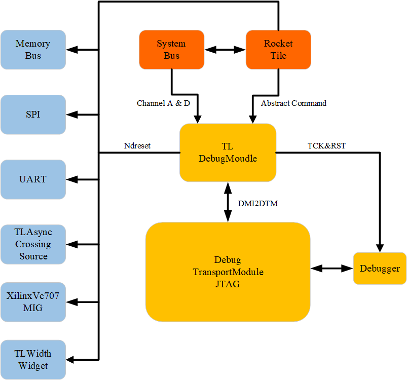    

<div>
<div align=left><div>   

Since the project is generated by Chisel, the modules used are in accordance with the specifications of SiFive and UC Berkeley.

Here, the TLDebugModule uses the Debug design from Rocket-Chip. The file location is:

```shell
:/src/main/scala/device/debug
|- Debug.scala
```

The DebugTransportModuleJTAG uses the design from the following location:

```shell
:/src/main/scala/device/debug
|- DebugTransport.scala
:/src/main/scala/JtagTap.scala
|- JtagTap.scala
|- JtagShifter.scala
|- JtagStateMachine.scala
```

###### 2.4.2.1.1 top_module: TLDebugModule (slave)

- **TLDebugModuleOuterAsync**
    - DMIToTL
    - TLXbar_7
    - TLDebugModuleOuter
    - IntSyncCrossingSource
    - TLAsyncCrossingSource
    - AsyncQueueSource_1
- **TLDebugModuleInnerAsync**
    - TLDebugModuleInner
    - TLAsyncCrossingSink
    - AsyncQueueSink_1
    - AsyncQueueSource_2
    - AsyncQueueSink_2
    - ResetCatchAndSync_d3

###### 2.4.2.1.2 top_module: DebugTransportModuleJTAG (master's interface)

- CaptureUpdateChain (as dtmInfoChain)
- CaptureUpdateChain_1 (as dtmAccessChain)
- CaptureChain (as idcodeChain)
- JtagTapController
    - JtagStateMachine
    - CaptureUpdateChain_2 (as irChain)
- JtagBypassChain

Overall, only DR Bypass and IR are implemented, which is not related to verification.

For reference, the Rocket-Chip project can be found at: [https://github.com/chipsalliance/rocket-chip/tree/master](https://github.com/chipsalliance/rocket-chip/tree/master).


##### 2.4.2.2 JTAG TAPC State Machine  
The JTAG controller incorporates the standard TAPC state machine as depicted in Figure 1, with the state machine handling clocking via TCK.
  
<div align=center>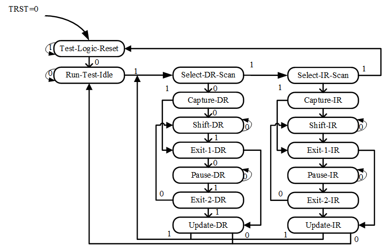  
  
<div>
<div align=left><div>  

##### 2.4.2.3  Resetting JTAG Logic
Asynchronous reset of the JTAG logic must be achieved by asserting the power-on-reset signal, which drives an internal jtag_reset signal.

Asserting jtag_reset will reset both the JTAG DTM and the debug module test logic. Since certain debug logic requires a synchronous reset, the jtag_reset signal is internally synchronized within the FU540-C000.

During operation, the JTAG DTM logic can also be reset without involving jtag_reset by asserting jtag_TMS while issuing five jtag_TCK clock ticks. This operation only resets the JTAG DTM, not the debug module.

##### 2.4.2.4 JTAG Clocking
The JTAG logic always operates within its own clock domain, which is clocked by jtag_TCK. The JTAG logic is fully static and has no minimum clock frequency requirement. The maximum jtag_TCK frequency is part-specific.
##### 2.4.2.5 JTAG Standard Instructions

The JTAG DTM implements the BYPASS and IDCODE instructions.
The IDCODE for the FU540-C000 is set to 0x20000913.

##### 2.4.2.6 JTAG Debug Commands

The JTAG DEBUG instruction accesses the SiFive debug module by connecting the debug scan register between jtag_TDI and jtag_TDO.

##### 2.4.2.7 Overview of States

A conceptual view is provided of the states a hart transitions through during run/halt debugging, which are influenced by various fields in dmcontrol, abstractcs, abstractauto, and command.     
  

<div align=center>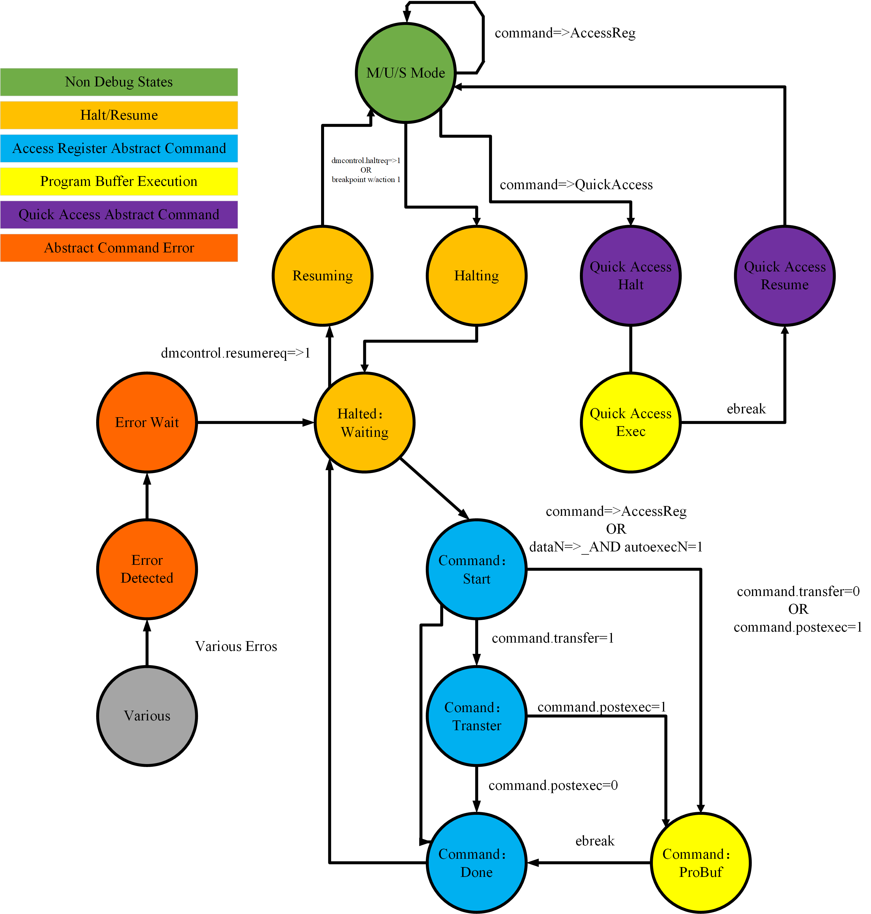    


<div>
<div align=left><div>   

#### 2.4.3 JTAG Design Verification         
##### Goals 
###### DV
Verify JTAG IP features by running dynamic simulations with a SV/UVM based testbench  
##### Design features  
For detailed information on JTAG design features, please see the **JTAG Technical Specification**.   
##### Testbench architecture  
###### Top level testbench  
Top level testbench is located at /trunk/hw/d2dv100_top/dv/dut_MEISHAV100_TOP_wrapper.sv. It instantiates the TOP DUT module /trunk/hw/d2dv100_top/rtl/top/MEISHAV100_TOP.sv. In addition, it instantiates the following interfaces, connects them to the DUT and sets their handle into `uvm_config_db`:  
+  Clock and reset interface  
+  Tilelink host interface  
+  JTAG IOs  
##### Global types & methods  
All common types and methods defined at the package level can be found in `JTAG_env_pkg`    
##### TL_agent  
JTAG Device instantiates `tl_agent` which provides the ability to drive and independently monitor random traffic via TL host interface into JTAG Device.
##### JTAG_agent
`JTAG agent` is used to drive and monitor JTAG items.  
##### 2.4.3.1 Testplan
###### 2.4.3.1.1 Allocate resources, initialize member variables.

```systemverilog
function new(string name, uvm_component parent);
        super.new(name, parent);
        set_type_override_by_type(dv_lib_pkg::dv_base_env_cfg#(tlul_base_env_pkg::tlul_base_reg_block)::get_type(), `tc_name_cfg::get_type());
        set_type_override_by_type(tlul_base_env_cfg::get_type(), `tc_name_cfg::get_type());
        cfg = `tc_name_cfg::type_id::create("test_cfg", this);
        jtag_base_env = jtag_env_pkg::jtag_env::type_id::create("jtag_base_env", this);
        dr_seq = new("dr_seq");
        dmstatus = new("dmstatus");
        dtmcs = new("dtmcs");
        dmcontrol = new("dmcontrol");        
        dmabstractcs = new("dmabstractcs");
        ////uart_base_env = uart_env::type_id::create("uart_base_env", this);
        ////set_type_override_by_type(dv_base_scoreboard#(dv_base_reg_pkg::dv_base_reg_block,dv_base_env_cfg,dv_base_env_cov)::get_type(), spi_scoreboard::get_type());
    endfunction //new()


```
###### 2.4.3.1.2 read_id_code(Reading IDCODE instruction)

```systemverilog
virtual task read_id_code();
    this.dr_seq.send_ir(this.jtag_base_env.m_jtag_agent.sequencer, 5, DTM_IDCODE);
    this.dr_seq.send_dr(this.jtag_base_env.m_jtag_agent.sequencer, 32, {32'h0000_0000});  // randomize value  IDCODE WIDTH is 32
    if(32'h20000913 != this.dr_seq.rsp.dout[31:0]) begin
        `uvm_error("read_id_code", $sformatf("%h not expect", this.dr_seq.rsp.dout))
    end
endtask


```

###### 2.4.3.1.3 read_dtmcs(Reading the DTM status)


```systemverilog
virtual task read_dtmcs();
automatic int unsigned data_array[];
automatic bit [6:0] abits = `DTM_ABITS;
automatic bit [2:0] idle = `DTM_IDLE_DELAY_CYCLE;
this.dr_seq.send_ir(this.jtag_base_env.m_jtag_agent.sequencer, 5, DTM_DTMCS);
this.dr_seq.send_dr(this.jtag_base_env.m_jtag_agent.sequencer, 32, {32'h0000_0000});  // randomize value  IDCODE WIDTH is 32
if({14'h0, 1'b0, 1'b0, 1'b0, idle[2:0], 2'b0, abits[5:0], 4'b1} != this.dr_seq.rsp.dout[31:0]) begin
    `uvm_error("read_dtmcs", $sformatf("%h not expect", this.dr_seq.rsp.dout))
end
// data_array = new[4];
// for ( int i = 0; i < 4; i++ ) begin
//     data_array[i] = this.dr_seq.rsp.dout[(i*8)+:8];
// end
data_array = new[1];
data_array[0] = this.dr_seq.rsp.dout[31:0];
this.dtmcs.unpack_ints(data_array);
`uvm_info(`gfn, $sformatf("read_dtmcs:\n%0s", this.dtmcs.sprint()), UVM_LOW)
// this.dtmcs.dmihardreset = this.dr_seq.rsp.dout[17];
// this.dtmcs.dmireset = this.dr_seq.rsp.dout[16];
// this.dtmcs.idle = this.dr_seq.rsp.dout[14:12];
// this.dtmcs.dmistat = this.dr_seq.rsp.dout[11:10];
// this.dtmcs.abits = this.dr_seq.rsp.dout[9:4];
// this.dtmcs.version = this.dr_seq.rsp.dout[3:0];
endtask


```
The function `this.dtmcs.unpack_ints(data_array);` is responsible for unpacking the integer values from the `data_array` and assigning them to the respective member variables of the `dtmcs` object.

###### 2.4.3.1.4 read_dmcontrol(Reading Debug Module Control)


```systemverilog
virtual task read_dmcontrol();
    automatic bit [31:0] data;
    automatic int unsigned data_array[];
    dmi_read(DM_DMCONTROL, data);
    data_array = new[1];
    data_array[0] = data[31:0];
    this.dmcontrol.unpack_ints(data_array);
    
    `uvm_info(`gfn, $sformatf("read_dmcontrol:\n%0s", this.dmcontrol.sprint()), UVM_LOW)

endtask


```

###### 2.4.3.1.5  dmi_read(Reading data via Debug Module Interface)


```systemverilog
virtual task dmi_read(bit [`DTM_ABITS-1:0] address, output bit [31:0] data);
    automatic int check_timeout = 0;
    // 执行DMI读操作
    this.dr_seq.send_ir(this.jtag_base_env.m_jtag_agent.sequencer, 5, DTM_DMI);
    // read dr more time , wait data flush complete
    this.dr_seq.send_dr(this.jtag_base_env.m_jtag_agent.sequencer, `DTM_ABITS + 34, {address[`DTM_ABITS-1:0], 32'h0, 2'h1});
    //data[31:0] = this.dr_seq.rsp.dout[33:2];
    this.dr_seq.send_dr(this.jtag_base_env.m_jtag_agent.sequencer, `DTM_ABITS + 34, {address[`DTM_ABITS-1:0], 32'h0, 2'h1});
    data[31:0] = this.dr_seq.rsp.dout[33:2];
    // this.dr_seq.send_dr(this.jtag_base_env.m_jtag_agent.sequencer, `DTM_ABITS + 34, {address[`DTM_ABITS-1:0], 32'h0, 2'h1});
    // data[31:0] = this.dr_seq.rsp.dout[33:2];
    // 等待读操作完成并检查状态
    do begin
        if(check_timeout++ > 5) begin
            `uvm_fatal("dmi_read", $sformatf("timeout,address 'h%0h, data 'h%0h: dmistat %h not expect", address, data, this.dtmcs.dmistat))
        end
        this.read_dtmcs();
    end while(this.dtmcs.dmistat == 2'h3); // repeat try once

    if(this.dtmcs.dmistat != 2'h0) begin
        `uvm_error("dmi_read", $sformatf("address 'h%0h, data 'h%0h: dmistat %h not expect", address, data, this.dtmcs.dmistat))
        // clear status
        this.dtmcs.dmireset = 1'b1;
        this.write_dtmcs();
    end
    else begin
        `uvm_info("dmi_read", $sformatf("address 'h%0h, data 'h%0h: success", address, data), UVM_LOW)
    end
endtask


```

###### 2.4.3.1.6 read_dmstatus(Reading data via Debug Module Interface)


```systemverilog
virtual task read_dmstatus();
    automatic bit [31:0] data;
    automatic int unsigned data_array[];
    dmi_read(DM_DMSTATUS, data);
    // data_array = new[4];
    // for ( int i = 0; i < 4; i++ ) begin
    //     data_array[i] = data[(i*8)+:8];
    // end
    data_array = new[1];
    data_array[0] = data[31:0];
    this.dmstatus.unpack_ints(data_array);
    `uvm_info(`gfn, $sformatf("read_dmstatus:\n%0s", this.dmstatus.sprint()), UVM_LOW)

endtask


```

###### 2.4.3.1.7 write_dmcontrol（Writing Debug Module Control）


```systemverilog
virtual task write_dmcontrol();
    automatic int unsigned data_array[];
    data_array = new[1];
    this.dmcontrol.pack_ints(data_array);
    dmi_write(DM_DMCONTROL, data_array[0]);
    
    `uvm_info(`gfn, $sformatf("write_dmcontrol:\n%0s", this.dmcontrol.sprint()), UVM_LOW)

endtask


```

###### 2.4.3.1.8 dmi_write(Writing data via Debug Module Interface)


```systemverilog
virtual task dmi_write(bit [`DTM_ABITS-1:0] address, input bit [31:0] data);
    automatic int check_timeout = 0;
    // 执行DMI写操作
    this.dr_seq.send_ir(this.jtag_base_env.m_jtag_agent.sequencer, 5, DTM_DMI);
    this.dr_seq.send_dr(this.jtag_base_env.m_jtag_agent.sequencer, `DTM_ABITS + 34, {address[`DTM_ABITS-1:0], data[31:0], 2'h2});

    // 等待写操作完成并检查状态
    do begin
        if(check_timeout++ > 5) begin
            `uvm_fatal("dmi_write", $sformatf("timeout,address 'h%0h, data 'h%0h: dmistat %h not expect", address, data, this.dtmcs.dmistat))
        end
        this.read_dtmcs();
    end while(this.dtmcs.dmistat == 2'h3); // repeat try once

    if(this.dtmcs.dmistat != 2'h0) begin
        `uvm_error("dmi_write", $sformatf("address 'h%0h, data 'h%0h: dmistat %h not expect", address, data, this.dtmcs.dmistat))
        this.write_dtmcs();
    end
    else begin
        `uvm_info("dmi_write", $sformatf("address 'h%0h, data 'h%0h: success", address, data), UVM_LOW)
    end
endtask


```

###### 2.4.3.1.9 read_dmabstractcs(Reading Abstract Control and Status)


```systemverilog
virtual task read_dmabstractcs();
    automatic bit [31:0] data;
    automatic int unsigned data_array[];
    dmi_read(DM_ABS_CS, data);
    data_array = new[1];
    data_array[0] = data[31:0];
    this.dmabstractcs.unpack_ints(data_array);
    
    `uvm_info(`gfn, $sformatf("dmabstractcs:\n%0s", this.dmabstractcs.sprint()), UVM_LOW)

endtask


```

###### 2.4.3.1.10  execute_progbuf(Setting buffer area progbufsize)


```systemverilog
virtual task execute_progbuf();

    write_dmabstract_cmd(8'h1, 24'h0);
    
    `uvm_info(`gfn, $sformatf("execute_progbuf"), UVM_LOW)

endtask


```

###### 2.4.3.1.11 access_hart_reg


```systemverilog
virtual task access_hart_reg(bit [2:0] aarsize, bit aarpostincrement, bit postexec, bit transfer, bit write, bit [15:0] regno);

    write_dmabstract_cmd(8'h0, {1'b0, aarsize, aarpostincrement, postexec, transfer, write, regno});
    
    `uvm_info(`gfn, $sformatf("access_hart_reg: 'h%0h, 'h%0h, 'h%0h, 'h%0h, 'h%0h, 'h%0h", aarsize, aarpostincrement, postexec, transfer, write, regno), UVM_LOW)

endtask


```

###### 2.4.3.1.12 access_hart_mem


```systemverilog
virtual task access_hart_mem(bit aamvirtual, bit [2:0] aamsize, bit aampostincrement, bit write, bit [1:0] target_specific);

    write_dmabstract_cmd(8'h2, {aamvirtual, aamsize, aampostincrement, 2'b0, write, target_specific, 14'h0});
    
    `uvm_info(`gfn, $sformatf("access_hart_mem: 'h%0h, 'h%0h, 'h%0h, 'h%0h, 'h%0h", aamvirtual, aamsize, aampostincrement, write, target_specific), UVM_LOW)

endtask


```

###### 2.4.3.1.13 write_dmabstract_cmd


```systemverilog
virtual task write_dmabstract_cmd(bit [7:0] cmdtype, bit [23:0] control);
    automatic bit [31:0] data;
    automatic int unsigned data_array[];
    data_array = new[1];
    data_array[0] = {cmdtype, control};
    dmi_write(DM_ABS_CMD, data_array[0]);
    
    `uvm_info(`gfn, $sformatf("write_dmabstract_cmd: 'h%0h, 'h%0h", cmdtype, control), UVM_LOW)

endtask


```

###### 2.4.3.1.14 The program is running.


```systemverilog
begin 
        read_id_code();
        //#5000ns;
        read_dtmcs();
        //#5000ns;
    end

    begin
        read_dmcontrol();
        //#5000ns;
        read_dmstatus();
        //#5000ns;
    end

    begin
        // halt all cpu
        this.dmcontrol.haltreq = 1'b1;
        this.dmcontrol.hasel = 1'b0;
        this.dmcontrol.hartsello = 10'b0;
        this.dmcontrol.dmactive = 1'b1; // must be 1 for debug
        this.write_dmcontrol();
        #5us;
        this.write_dmcontrol();
    end

    begin
        // test abstract cmd
        this.read_dmabstractcs();
        this.access_hart_reg(2/*aarsize*/, 1/*aarpostincrement*/, 0/*postexec*/, 1/*transfer*/, 1/*write*/, 0/*regno*/);
        this.access_hart_mem(0/*aamvirtual*/, 2/*aamsize*/, 1/*aampostincrement*/, 1/*write*/, 2'b0/*target_specific*/);
        this.execute_progbuf();
    end


```

##### FPGA Verification Via OpenOCD

Users interact with the debugging host (such as a laptop) running a debugger (such as GDB). The debugger communicates with the debug adapter (for example, **OpenOCD**, which may include a hardware driver) to interface with the debug transport hardware (such as an Olimex USB-JTAG adapter). The debug transport hardware connects the debug host to the platform's Debug Transport Module (DTM). The DTM uses the Debug Module Interface (DMI) to provide access to one or more Debug Modules (DM).

To stop one or more harts, the debugger selects them, sets haltreq, and then waits for the allhalted indication that the harts have stopped. It can then clear haltreq to 0, or keep it high to catch harts that reset while paused.

The platform is a single integrated circuit composed of one or more components. Some components may be RISC-V cores, while others may have different functions. Typically, they will all be connected to a single system bus. A single RISC-V core contains one or more hardware threads, called harts.
#### 2.4.4 Hardware Interfaces    
The mapping of top-level JTAG signals in the U500 module is represented in the following table:

JTAG Singal | Top JTAG Singal | I/O
:-----------: | :-----------: | :-----------:
TCK | jtag_jtag_TCK | input
TMS | jtag_jtag_TMS | input
TDI | jtag_jtag_TDI | input
TDO | jtag_jtag_TDO | output
#### 2.4.5 Registers    

##### 2.4.5.1 Debug Module Debug Bus Registers

Address | Name
:-----------: | :-----------:
0x04 |   Abstract Data 0 (data0)
0x0f|Abstract Data 11 (data11)
0x10|Debug Module Control (dmcontrol)
0x11|Debug Module Status (dmstatus)
0x12|Hart Info (hartinfo)
0x13|Halt Summary 1 (haltsum1)
0x14|Hart Array Window Select (hawindowsel)
0x15|Hart Array Window (hawindow)
0x16|Abstract Control and Status (abstractcs)
0x17|Abstract Command (command)
0x18|Abstract Command Autoexec (abstractauto)
0x19|Configuration String Pointer 0 (confstrptr0)
0x1a|Configuration String Pointer 1 (confstrptr1)
0x1b|Configuration String Pointer 2 (confstrptr2)
0x1c|Configuration String Pointer 3 (confstrptr3)
0x1d|Next Debug Module (nextdm)
0x20|Program Buffer 0 (progbuf0)
0x2f|Program Buffer 15 (progbuf15)
0x30|Authentication Data (authdata)
0x34|Halt Summary 2 (haltsum2)
0x35|Halt Summary 3 (haltsum3)
0x37|System Bus Address 127:96 (sbaddress3)
0x38|System Bus Access Control and Status (sbcs)
0x39|System Bus Address 31:0 (sbaddress0)
0x3a|System Bus Address 63:32 (sbaddress1)
0x3b|System Bus Address 95:64 (sbaddress2)
0x3c|System Bus Data 31:0 (sbdata0)
0x3d|System Bus Data 63:32 (sbdata1)
0x3e|System Bus Data 95:64 (sbdata2)
0x3f|System Bus Data 127:96 (sbdata3)
0x40 |Halt Summary 0 (haltsum0) |

##### 2.4.5.2 DTM JTAG DTM Registers

Address | Name | Descripition
:-----------: | :-----------: | :-----------:
0x00 | BYPASS | JTAG recommends this encoding
0x01 | IDCODE | JTAG recommends this encoding
0x10 | DTM Control and Status (dtmcs) | For Debugging
0x11 | Debug Module Interface Access (dmi) | For Debugging
0x12 | Reserved (BYPASS) | Reserved for future RISC-V debugging
0x13 | Reserved (BYPASS) | Reserved for future RISC-V debugging
0x14 | Reserved (BYPASS) | Reserved for future RISC-V debugging
0x15 | Reserved (BYPASS) | Reserved for future RISC-V debugging
0x16 | Reserved (BYPASS) | Reserved for future RISC-V debugging
0x17 | Reserved (BYPASS) | Reserved for future RISC-V debugging
0x1f | BYPASS | JTAG requires this encoding


###### 2.4.5.2.1 IDCODE(0X01)

When the TAP state machine is reset, this register (located in the Instruction Register, IR) is selected. Its definition is exactly consistent with that specified in the IEEE Standard 1149.1-2013.

This entire register is read-only.

31:28 | 27:12 | 11:1 | 0
:-----------: | :-----------: | :-----------: | :-----------:
vERSION | pARTnUMBER | mANUFLD | 1


**ManufId:** Bits 6:0 must be the bits 6:0 of the design/manufacturer identification code specified by the JEDEC standard JEP106. Bits 10:7 contain the modulo-16 count of the continuation characters (0x7f) in the same identification code.

###### 2.4.5.2.2  DTM Control and Status (dtmcs，0x10)

31:18 | 17 | 16 | 15 | 14:12 | 11:10 | 9:4 | 3:0
:-----------: | :-----------: | :-----------: | :-----------: | :-----------: | :-----------: | :-----------: | :-----------:|
0 | dmihardreset | dmireset | 0 | idle | dmistat | abits | version

| Field | Description | Access | Reset |
| :-----------: | :-----------: | :-----------: | :-----------: |
| dmihardreset | Writing a 1 to this bit performs a hard reset on the DTM, causing it to forget any ongoing DMI transactions. This should generally only be used when the debugger has reason to expect that the ongoing DMI transactions will never complete (e.g., reset conditions cause an in-progress DMI transaction to be aborted). | W | - |
| dmireset | Writing a 1 to this bit clears the error state and allows the DTM to retry or complete the previous transaction. | W | - |
| idle | This is a hint to the debugger regarding the minimum number of cycles it should spend in RunTest/Idle after each DMI scan to avoid returning the 'busy' code (dmistat is 3). The debugger must still check dmistat as necessary.  0: No need to enter Run-Test/Idle.   1: Enter Run-Test/Idle and exit immediately. 2: Enter Run-Test/Idle, stay for 1 cycle, then leave. | R  | Preset |
| dmistat | 0: No error. 1: Reserved. Interpretation is the same as for 2. 2: Operation failed (caused by op (2)). 3: Attempted operation while a DMI access is still in progress (caused by op (3)). | R      | 0      |
| abits | The size of the address in dmi. | R      | Preset |
| version | 0: Version described in specification version 0.11. 1: Version described in specification version 0.13. 15: Version not described in any available version of this specification. | R  | 1 |
##### 2.4.5.3 Debug  Module Interface Access(dmi,0x11)

The Debug Module is subordinate to a bus known as the Debug Module Interface (DMI). The master of this bus is the Debug Transport Module (DTM). The Debug Module Interface can be a simple bus with a master and a slave, or it can utilize a more comprehensive bus, such as TileLink or AMBA Advanced Peripheral Bus. The details are left to the system designer.

DMI uses **7 to 32 address bits**. It supports **read and write** operations. The bottom of the address space is used for the first (often the only) DM. Additional space can be used for custom debug devices, other cores, additional DMs, etc. If there are additional DMs on this DMI, the base address of the next DM in the DMI address space is given in `nextdm`.

The Debug Module is controlled by accessing its DMI address space through registers.


| Field   | Description                                                  | Access | Reset |
| :-----------: | :-----------:                                                  | :-----------: | :----------: |
| address | The address used for DMI access. This value is used for accessing the DM via DMI during Update-DR. | R/W | 0 |
| data    | The data sent to the DM via DMI during Update-DR, and the data returned by the DM after a previous operation. | R/W | 0 |
| op      | When the debugger writes this byte, the meanings are as follows: 0: Ignore data and address. Do not send anything via DMI during Update-DR. This operation will never result in a busy or error response. The address and data reported by the following Capture-DR are undefined. 1: Read from address. (Read) 2: Write data to address. (Write) 3: Reserved. | | |

When the debugger reads this byte, it indicates:  
0: The previous operation was successfully completed.  
1: Reserved.  
2: The previous operation failed. The data scanned into dmi during this access will be ignored. This state is sticky and can be cleared by writing `dmireset` in `dtmcs`. This indicates that the DM itself responded with an error. There is no specific case for a DM to respond with an error, and DMI does not need to support returning an error.  
3: An operation was attempted while a DMI request was still in progress. The data scanned into dmi during this access will be ignored. This state is sticky and can be cleared by writing `dmireset` in `dtmcs`. If the debugger sees this state, it needs to provide more TCK edges to the target between UpdateDR and Capture-DR. The simplest method is to add extra transitions in Run-Test/Idle.

To read an arbitrary Debug Module register, select dmi, scan a value with `op` set to 1, and set the address to the desired register address. During Update-DR, the operation will start, and the result of the operation will be captured as data during Capture-DR. If the operation does not complete in time, `op` will be 3, and the value in `data` must be ignored. The busy state must be cleared by writing `dmireset` in `dtmcs`, and a second scan must be performed. This process must be repeated until `op` returns 0. In subsequent operations, the debugger should allow more time between Capture-DR and Update-DR.

To write an arbitrary Debug Module register, select dmi, scan a value with `op` set to 2, and set the address and data to the desired register address and data, respectively. From that point on, everything is exactly the same as for a read, except that a write is performed instead of a read.

There is almost no need to scan the IR, thus avoiding most of the inefficiencies in typical JTAG usage.

##### 2.4.5.4 BYPASS
 
 This is an invalid 1-bit register, used when the debugger does not wish to communicate with this TAP. The entire register is read-only.

##### 2.4.5.5 Debug Module Control (dmcontrol, 0x10)

31 | 30 | 29 | 28 | 27 | 26 | 25:16|15:6 | 5:4 | 3 | 2 | 1 | 0
:-----------: | :-----------: | :-----------: | :-----------: | :-----------: | :-----------: |:-----------: |:-----------: | :-----------: | :-----------: | :-----------: | :-----------: |:-----------:
haltreq | resumereq | hartreset | ackhavereset | 0 | hasel | hartsello|hartselhi | 0 | setresethaltreq | clrresethaltreq | ndmreset | dmactive

| Field            | Description    | Access | Reset |
|:------------------:|:----------:|:--------:|:-------:|
| haltreq          | Writing a 0 clears the halt request bit for all currently selected harts, potentially canceling outstanding halt requests for those harts. Writing a 1 sets the halt request bit for all currently selected harts. Running harts will stop when their halt request bit is set. The write applies to the new values of hartsel and hasel. | W      | -     |
| resumereq        | Writing a 1 will cause them to resume once if the currently selected harts are stopped at the time of the write operation. If haltreq is set, resumereq is ignored. The write applies to the new values of hartsel and hasel.                                                                                                                         | W      | -     |
| hartreset        | This optional bit writes the reset bit for all currently selected harts. To perform a reset, the debugger writes a 1, followed by a 0 to cancel the reset signal. While this bit is 1, the debugger cannot change the selected hart. If this feature is not implemented, the bit always remains 0, so the debugger can write 1 and then read the register to see if it is supported. | R/W    | 0     |
| ackhavereset     | 0: Invalid. 1: Clears the havereset bit for any selected hart. The write applies to the new values of hartsel and hasel.                                                                            | W1     | -     |
| hasel            | 0: There is currently one hart selected by hartsel. 1: There may be multiple harts currently selected, consisting of the hart selected by hartsel, plus any harts selected by the hart mask register.                                                                                 | R/W    | 0     |
| hartsello       | The lower 10 bits of hartsel: The dm-specific index of the hart to be selected. This hart is always part of the currently selected hart.                                                                                                   | R/W    | 0     |
| hartselhi       | The upper 10 bits of hartsel: The dm-specific index of the hart to be selected. This hart is always part of the currently selected hart.                                                                                                                                                                                                                   | R/W    | 0     |
| setresethaltreq | This optional bit writes the reset halt request bit for all currently selected harts unless clrresethaltreq is set to 1 at the same time. When set to 1, each selected hart will stop on the next reset. The reset request bit does not clear automatically. The debugger must write clrresethaltreq to clear it. The write applies to the new values of hartsel and hasel. hasresethaltreq = 0 indicates that this byte is not implemented. | W1     | -     |
| clrresethaltreq | This optional bit clears the reset request bit for all currently selected harts. The write applies to the new values of hartsel and hasel.                                                                                                                                                                                                                 | W1     | -     |
| ndmreset         | This bit controls the reset signal from the DM to the rest of the system. The signal should reset every part of the system, including each hart, except for the DM and any logic required to access the DM. To perform a system reset, the debugger writes a 1, followed by a 0 to cancel the reset.                                                                                                                          | R/W    | 0     |
| dmactive         | This bit acts as a reset signal for the debug module itself. 0: The module is in its reset state, including the authentication mechanism, with the exception of dynamic bits, which are the only bits that can be written to something other than their reset value. 1: The module is functioning normally.                                                                                                              | R/W    | 0     |

##### 2.4.5.6 Debug Module Status (dmstatus, at 0x11)

This register reports the status of the entire debug module and the currently selected hart as defined in `hasel`. Its address will not change in the future because it contains version information.

The entire register is read-only.

31:23 | 22 | 21:20 | 19 | 18 | 17 | 16 | 15 | 14 | 13 | 12 | 11 | 10 | 9 | 8 | 7 | 6 | 5 | 4 | 3:0  
:-----------: | :-----------: | :-----------: | :-----------: | :-----------: | :-----------: | :-----------: | :-----------: | :-----------: | :-----------: | :-----------: | :-----------: | :-----------: | :-----------: | :-----------: | :----------: | :-----------: | :-----------: | :-----------: | :-----------:
0 | impebreak | 0 | allhavereset | anyhavereset | allresumeack | anyresumeack | allnonexistent | anynonexistent | allunavail | anyunavail | allrunning | anyrunning | allhalted | anyhalted | authenticated | authbusy | hasresethaltreq | confstrptrvalid | version

Field | Description | Access | Reset
:-----------: | :-----------: | :-----------: | :-----------:
impebreak | If set to 1, there is an implicit ebreak instruction at a non-existent word following the program buffer. This allows the debugger to avoid writing ebreak itself and allows the program buffer to be one word shorter. When proprobussize is 1, this value must be 1. | R | Preset
allhavereset | This bit is 1 when all currently selected harts have been reset and the reset has not been acknowledged. | R | -
anyhavereset | This bit is 1 when at least one currently selected hart has been reset and that hart has not acknowledged the reset. | R | -
allresumeack | This bit is 1 when all currently selected harts have acknowledged their last resume request. | R | -
anyresumeack | This bit is 1 when any currently selected hart has acknowledged its last resume request. | R | -
allnonexistent | This bit is 1 when the currently selected harts do not exist in this platform. | R | -
anynonexistent | This bit is 1 when the currently selected harts do not exist in this platform. | R | -
allunavail | This bit is 1 when all currently selected harts are unavailable. | R | -
anyunavail | This bit is 1 when any currently selected hart is unavailable. | R | -
allrunning | This bit is 1 when all currently selected harts are running. | R | -
anyrunning | This bit is 1 when any currently selected hart is running. | R | -
allhalted | This bit is 1 when all currently selected harts are halted. | R | -
anyhalted | This bit is 1 when any currently selected hart is halted. | R | -
authenticated | 0: Authentication is required before using the DM. 1: Authentication check passed. | R | Preset |
authbusy | 0: The authentication module is ready to process the next read of authdata. 1: The authentication module is busy. Accessing authdata will result in unspecified behavior. | R | 0 |
hasresethaltreq | 1: If this debug module supports the reset-halt feature controlled by setresethaltreq and clrresethaltreq bits. 0: Otherwise. | R | Preset |
confstrptrvalid | 0: confstrptr0{confstrptr3 stores information unrelated to the configuration string. 1: confstrptr0{confstrptr3 stores the address of the configuration string. | R | Preset |
version | 0: No debug module exists. 1: There is a debug module that complies with version 0.11 of this specification. 2: There is a debug module that complies with version 0.13 of this specification. 3: There is a debug module, but it does not comply with any available version of this specification. | R |  |

##### 2.4.5.7 Abstract Control and Status (abstractcs, at 0x16)

31：29 | 28：24 | 23:13 | 12 | 11 | 10:8 | 7:4 | 3:0
:-----------: | :-----------: | :-----------: | :-----------:| :-----------: | :-----------: | :-----------: | :-----------:
0 | progbufsize | 0 | busy | 0 | cmderr | 0 | datacount

Sure, here is the professional English translation of the provided table:

Field | Description | Access | Reset
:-----------: | :-----------: | :-----------: | :-----------:
progbufsize | Size of the program buffer, represented in 32-bit words. Valid sizes range from 0 to 16. | R | Preset
busy | 1: Indicates that an abstract command is currently being executed. This bit is set immediately when the command is written and is cleared only after the command has completed. | R/W | 0
cmderr | Captures if an abstract command fails. The bits in this byte remain unchanged until they are cleared by writing 1 to them. No abstract command will be initiated until this value is reset to 0. This byte contains a valid value only when busy is 0. 0 (none): No error. 1 (busy): An abstract command is being executed when either command, abstractcs, or abstractauto is written, or when one of the data or program registers is read or written. This status can only be written when cmderr contains 0. 2 (not supported): The requested command is not supported, regardless of whether the hart is running or not. 3 (exception): An exception occurred during the execution of the command (e.g., while executing the program buffer). 4 (halt/resume): The abstract command cannot be executed because the hart is not in the required state (running/stopped) or is unavailable. 5 (bus): The abstract command failed due to a bus error (e.g., alignment, access size, or timeout). 7 (other): The command failed for other reasons. | R/W1C | 0
datacount | The number of data registers implemented as part of the abstract command interface. Valid lengths range from 1 to 12. | R | Preset-
#### 2.4.6 Checklist  
### 2.5 QSPI    
#### 2.5.1 QSPI Technical Specification  

#####  Description  
SPI_1 is mounted on the MEISHAV100 as an SPI master, responsible for controlling external SPI data transfers. SPI_1 utilizes the open-source axi-spi-master code, which can be referenced at [https://github.com/pulp-platform/axi_spi_master](https://github.com/pulp-platform/axi_spi_master).  
#####  Features  
+ Primarily designed for serial NOR Flash and ADC devices
+ Supports standard SPI, dual SPI, or quad-channel SPI commands
   + Signal SD[0] may also be recognized by other   
   + SPI masters as “MOSI,” while SD[3] is commonly referred to as “MISO”
+ Separate FIFOs for RX and TX data
   + 288-byte capacity for TX data and 256-byte capacity for RX data
   + FIFO loading/unloading via 32-bit TL-UL registers
   + Supports arbitrary byte counts in each transaction
+ SPI clock rate controlled by a separate input clock to the core
   + SPI SCK line typically toggles at half the core clock frequency
   + An additional clock rate divider is available to reduce the frequency if needed
+ Supports all SPI polarities and phases (CPOL, CPHA)
   + Additional support for “full-cycle” SPI transactions, where data can be read after an entire SPI clock cycle (as opposed to the typical half cycle in SPI interfaces)
+ Single Transfer Rate (STR) only (i.e., receiving data on multiple lines but only sampling data on one clock edge)
   + Does not support Dual Transfer Rate (DTR)
+ Pass-through mode for coordination with the SPI_DEVICE IP
+ Automatic control of the chip select signal line
+ Compact interrupt footprint: two lines corresponding to two distinct interrupt classes: “error” and “spi_event”
   + Fine-grained interrupt masking provided by an auxiliary enable register     
#### 2.5.2 Theory of Operation  
#### 2.5.3 QSPI Design Verification  


Connect `spi_1` to the QSPI on MEISHAV100, and use data sent via `spi_1` to control QSPI for reading and writing memory.

##### 2.5.3.1 Connecting SPI_1 and QSPI

Add the following code to the top-level file **dut_MEISHAV100_TOP_wrapper.sv**:


```verilog
// spi_1 test

assign spi_slave_if.spi_sdo         =   spi_master_sdo;
assign spi_master_sdi               =   spi_slave_if.spi_sdi;
assign spi_slave_if.spi_clk         =   spi_master_clk;
assign spi_slave_if.spi_csn         =   spi_master_csn[0];

```
`spi_slave_if` is a virtual interface added for testing QSPI, used to connect to QSPI. The `spi_master` signal is the `spi_1` signal brought out at the top level.

##### 2.5.3.2 Writing the Test Case

Follow the structure of other test cases, primarily modifying the content within the `main_phase`:


```verilog
tl_agent_pkg::tl_host_single_seq seq;
seq = new("seq");
seq.control_addr_alignment = 1;
seq.control_rand_source = 1;
seq.control_rand_size = 1;
seq.override_a_source_val = 1;
seq.overridden_a_source_val = 2;

`DV_CHECK_RANDOMIZE_WITH_FATAL(seq,
  size             == 2;
  mask             == 'hf;
  source == 2;
  write == 1;
)

// Initialize Mode and clock and data length, command and address length, Dummy cycles

// reset FIFO
seq.addr = `SPI1_REG64_STATUS;
seq.data = ('h1 << 4);
seq.start(env.virtual_sequencer.match_sqr("tl", "tile-RocketTile*tl_mem_mst"));


// set clock, spi_clk = axi_clk / (2 * (clk_div + 1))
seq.addr = `SPI1_REG64_CLKDIV;
seq.data = 32'h1;
seq.start(env.virtual_sequencer.match_sqr("tl", "tile-RocketTile*tl_mem_mst"));

// set data length and command to be 8 bits, address 0 bits
seq.addr = `SPI1_REG64_SPILEN;
seq.data = {16'h8, 2'h0, 6'h0, 2'h0, 6'h8};
seq.start(env.virtual_sequencer.match_sqr("tl", "tile-RocketTile*tl_mem_mst"));


// set write dummy cycles to be 0, read dummy cycles to be 33
seq.addr = `SPI1_REG64_SPIDUM;
seq.data = {16'h0, 16'h21};
seq.start(env.virtual_sequencer.match_sqr("tl", "tile-RocketTile*tl_mem_mst"));

```

Select the values for the configuration registers based on whether QSPI transfer is used or not.


```verilog
// if transmit by qspi mode, need to set reg0 of qspi to 1 
if (qspi_mode == 1) begin
    seq.addr = `SPI1_REG64_SPICMD;
    seq.data = 8'h01 << 24;
    seq.start(env.virtual_sequencer.match_sqr("tl", "tile-RocketTile*tl_mem_mst"));

    seq.addr = `SPI1_REG64_STATUS;
    seq.data = 32'h0102;
    seq.start(env.virtual_sequencer.match_sqr("tl", "tile-RocketTile*tl_mem_mst"));

    seq.addr = `SPI1_REG64_TXFIFO;
    seq.data = 8'h01 << 24;
    seq.start(env.virtual_sequencer.match_sqr("tl", "tile-RocketTile*tl_mem_mst"));
end

```

Start sending data from a specific address, and increment the address by 4 after each data transmission.


```verilog
// set data length and address to be 32 bits, command 8 bits
seq.addr = `SPI1_REG64_SPILEN;
seq.data = {16'h20, 2'h0, 6'h20, 2'h0, 6'h8};
seq.start(env.virtual_sequencer.match_sqr("tl", "tile-RocketTile*tl_mem_mst"));

// set initial address and data
rw_addr = 32'h5003_F060;
write_data = 32'h1;

repeat(2000) begin
    `uvm_info(`gfn, $sformatf("spi_1 send data: %h", write_data), UVM_NONE)
    // write data to rw_addr
    seq.write = 1;
    seq.addr = `SPI1_REG64_SPICMD;
    seq.data = 32'h0200_0000;
    seq.start(env.virtual_sequencer.match_sqr("tl", "tile-RocketTile*tl_mem_mst"));

    seq.addr = `SPI1_REG64_SPIADR;
    seq.data = rw_addr;
    seq.start(env.virtual_sequencer.match_sqr("tl", "tile-RocketTile*tl_mem_mst"));

    if (qspi_mode == 1) begin
        seq.addr = `SPI1_REG64_STATUS;
        seq.data = 32'h0108;
        seq.start(env.virtual_sequencer.match_sqr("tl", "tile-RocketTile*tl_mem_mst"));
    end
    else begin
        seq.addr = `SPI1_REG64_STATUS;
        seq.data = 32'h0102;
        seq.start(env.virtual_sequencer.match_sqr("tl", "tile-RocketTile*tl_mem_mst"));
    end

    seq.addr = `SPI1_REG64_TXFIFO;
    seq.data = write_data;
    seq.start(env.virtual_sequencer.match_sqr("tl", "tile-RocketTile*tl_mem_mst"));
    #1000ns;

    // read data from rw_addr, data will be stored in rxfifo
    seq.addr = `SPI1_REG64_SPICMD;
    seq.data = 32'h0b00_0000;
    seq.start(env.virtual_sequencer.match_sqr("tl", "tile-RocketTile*tl_mem_mst"));

    seq.addr = `SPI1_REG64_SPIADR;
    seq.data = rw_addr;
    seq.start(env.virtual_sequencer.match_sqr("tl", "tile-RocketTile*tl_mem_mst"));

    if (qspi_mode == 1) begin
        seq.addr = `SPI1_REG64_STATUS;
        seq.data = 32'h0104;
        seq.start(env.virtual_sequencer.match_sqr("tl", "tile-RocketTile*tl_mem_mst"));
    end
    else begin
        seq.addr = `SPI1_REG64_STATUS;
        seq.data = 32'h0101;
        seq.start(env.virtual_sequencer.match_sqr("tl", "tile-RocketTile*tl_mem_mst"));
    end
    #1000ns;

    // read data from spi_1 rxfifo
    seq.addr = `SPI1_REG64_RXFIFO;
    seq.write = 0;
    seq.start(env.virtual_sequencer.match_sqr("tl", "tile-RocketTile*tl_mem_mst"));

    rw_addr += 32'h4;
    write_data += 32'h1;
end

```

##### 2.5.3.3 Result of Test

Primarily test the address spaces for DDR and IRAM. The testing method involves separately testing the low, middle, and high parts of both address spaces. A portion of addresses in each part are tested. The test results are as follows:

Address | Result | Issue
:-----------: | :-----------: | :-----------:
0x8000_0000~0x8000_9C40 (10000 addresses) | Correct | 
0x9FFF_D1C0~0xA000_130C (10000 addresses) | Correct | 
0xBFFF_63C0~0xC000_0000 (10000 addresses) | Partial Errors | The last three addresses read data as 0. After comparing waveforms and code, it was found to be an issue with the mounted VIP. Setting the working mode of the VIP mounted to `spi_1` to SLAVE resulted in correct operation.
0x5000_0000~0x5000_1F40 (2000 addresses) | Correct | 
0x5003_F060~0x5004_0FA0 (2000 addresses) | Correct | 
0x5007_E0C0~0x5008_0000 (2000 addresses) | Correct | 

##### 2.5.3.4 Software Testing

Translate the above SystemVerilog test code into C language code for software testing. The C code is as follows:


```c
// See LICENSE for license details.
#include <stdint.h>


#include <platform.h>

#include "common.h"
#include "spi1.h"

#define QSPI 1

#define DEBUG
#include "kprintf.h"

int main(void)
{
    long long addr[] = {0x80000000, 0x9FFFF830, 0xBFFFF060, 0x50000000, 0x50003830, 0x50007060};
  
    REG32(uart, UART_REG_TXCTRL) = UART_TXEN;  // donot delete

    kprintf("Test begin ! @ core: %x", read_csr(mhartid));

    // reset fifo
    _REG32(SPI1_BASE_ADDR, SPI1_REG_STATUS) = (1 << 4);

    // set clock, spi_clk = axi_clk / (2 * (clk_div + 1))
    _REG32(SPI1_BASE_ADDR, SPI1_REG_CLKDIV) = 0x01;

    // set data length and command to be 8 bits, address 0 bits
    _REG32(SPI1_BASE_ADDR, SPI1_REG_SPILEN) = (0x08 << 16) | 0x08;
    _REG32(SPI1_BASE_ADDR, SPI1_REG_SPIDUM) = 0x21;

    // enable qspi transmit
    if (QSPI == 1) {
        _REG32(SPI1_BASE_ADDR, SPI1_REG_SPICMD) = (0x01 << 24);
        _REG32(SPI1_BASE_ADDR, SPI1_REG_STATUS) = 0x0102;
        _REG32(SPI1_BASE_ADDR, SPI1_REG_TXFIFO) = (0x01 << 24);
    }

    // set data length and address to be 32 bits, command 8 bits
    _REG32(SPI1_BASE_ADDR, SPI1_REG_SPILEN) = (0x20 << 16 | 0x20 << 8 | 0x08);

    for (int i = 0; i < 6; ++ i) {
        // set initial address and data
        int data = 0x12345678;
        long long rw_addr = addr[i];
        if (i == 0) kprintf("DDR test begin!");
        else if (i == 3) kprintf("IRAM test begin!");
        for (int j = 1; j <= 1000; ++ j) {
            // wait until SPI is idle
            while ((_REG32(SPI1_BASE_ADDR, SPI1_REG_STATUS) & 0x01) == 0);

            // set write command and address
            _REG32(SPI1_BASE_ADDR, SPI1_REG_SPICMD) = (0x02 << 24);
            _REG32(SPI1_BASE_ADDR, SPI1_REG_SPIADR) = rw_addr;

            // initiate a write operation with select CS0
            if (QSPI == 1) _REG32(SPI1_BASE_ADDR, SPI1_REG_STATUS) = 0x0108;
            else _REG32(SPI1_BASE_ADDR, SPI1_REG_STATUS) = 0x0102;

            // wait until tx buffer has available place
            while (((_REG32(SPI1_BASE_ADDR, SPI1_REG_STATUS) >> 24) & 0xFF) >= 8);

            // write data to addr
            _REG32(SPI1_BASE_ADDR, SPI1_REG_TXFIFO) = data;

            // wait until SPI is idle
            while ((_REG32(SPI1_BASE_ADDR, SPI1_REG_STATUS) & 0x01) == 0);

            // set read command and address
            _REG32(SPI1_BASE_ADDR, SPI1_REG_SPICMD) = (0x0b << 24);
            _REG32(SPI1_BASE_ADDR, SPI1_REG_SPIADR) = rw_addr;

            // initiate a write operation with select CS0
            if (QSPI == 1) _REG32(SPI1_BASE_ADDR, SPI1_REG_STATUS) = 0x0104;
            _REG32(SPI1_BASE_ADDR, SPI1_REG_STATUS) = 0x0101;

            // wait until rx buffer has available place
            while (((_REG32(SPI1_BASE_ADDR, SPI1_REG_STATUS) >> 16) & 0xFF) == 0);

            // read data from rxfifo
            int read_data = _REG32(SPI1_BASE_ADDR, SPI1_REG_RXFIFO);

            if (read_data != data) {
                kprintf("SPI1_TEST FAIL! at addr: %x, the correct data is: %x, but get: %x", rw_addr, data, read_data);
            }
            else kprintf("SPI1_TEST PASS! at addr: %x", rw_addr);

            rw_addr += 0x4;
            data += 0x1;
        }
        if (i == 2) kprintf("DDR test end!");
        else if (i == 5) kprintf("IRAM test end!");
    }
    
    kprintf("Test end ! @ core: %x", read_csr(mhartid));


    if (1){
        kprintf("PASS");
    }
    else{
        kprintf("FAIL");
    }

    kprintf(SHUTDOWN_FLAG_STR);  // donnot delete

    return 0;
}


```

Run the test case `soft_base_test.sv`. Mount the AXI VIP in the `initialize` function of the `soft_base_test_cfg` class to ensure QSPI operates normally.


```verilog
foreach(this.axi_agent_sw[i]) begin
    this.axi_agent_sw[i] = dv_utils_pkg::ON;
    if(uvm_is_match("*vc707mig1gb*s_axi_slv*", i)) begin
        this.axi_agent_work_mode[i] = dv_utils_pkg::SLAVE;
    end
    else if(uvm_is_match("*u_axi_spi_slave*m_axi_mst*", i)) begin // for qspi
        this.axi_agent_work_mode[i] = dv_utils_pkg::SLAVE;
    end
    else if(uvm_is_match("*vc707axi_to_pcie_x1*m_axi_slv*", i)) begin
        this.axi_agent_work_mode[i] = dv_utils_pkg::ONLY_MONITOR;
    end
    else if(uvm_is_match("*vc707axi_to_pcie_x1*s_axi_mst*", i)) begin
        this.axi_agent_work_mode[i] = dv_utils_pkg::SLAVE;
    end
    else begin
        this.axi_agent_work_mode[i] = dv_utils_pkg::ONLY_MONITOR;
    end
    `uvm_info(get_type_name(), $sformatf("set_vip_agent_work_mode for inst_path %s, work_mode %s", i, this.axi_agent_work_mode[i].name()), UVM_DEBUG);
    //this.m_axi_agent_cfg[i].if_mode = dv_utils_pkg::Host;  // donnot need add in here
end

```

Then, run this test case, compile the above C code into a hex file and load it into the RAM. Run the simulation, and the simulation results are as follows:

Address | Result | Issue
:-----------: | :-----------: | :-----------:
0x8000_0000~0x8000_0FA0 (500 addresses) | Correct | 
0x9FFF_F830~0xA000_07D0 (500 addresses) | Correct | 
0xBFFF_F060~0xC000_0000 (500 addresses) | Correct | 
0x5000_0000~0x5000_0FA0 (500 addresses) | Correct | 
0x5003_F830~0x5004_07D0 (500 addresses) | Correct | 
0x5007_F060~0x5008_0000 (500 addresses) | Correct | 


#### 2.5.4 Hardware Interfaces  
Signal | Direction | Description
:-----------: | :-----------: | :-----------:
spi_clk | output | Master Clock
spi_csn0 | output | Chip Selcet0
spi_csn1 | output | Chip Selcet1
spi_csn2 | output | Chip Selcet2
spi_csn3 | output | Chip Selcet3
spi_mode[1:0] | output | SPI Mode
spi_sdo0 | output | Output Line0
spi_sdo1 | output | Output Line1
spi_sdo2 | output | Output Line2
spi_sdo3 | output | Output Line3
spi_sdi0 | input | Input Line0
spi_sdi1 | input | Input Line1
spi_sdi2 | input | Input Line2
spi_sdi3 | input | Input Line3    

#### 2.5.5 Registers  

According to the pulpino documentation, the control registers and related functionalities for SPI_1 are as follows:  

Offset | Name
:-----------:| :-----------:
0x00 | STATUS
0x08 | CLKDIV
0x10 | SPICMD
0x18 | SPIADR
0x20 | SPILEN
0x28 | SPIDUM
0x40 | TXFIFO
0x80 | RXFIFO


##### 2.5.5.1 STATUS（Status Register）  

**Reset Value：0x0000_0000**

- **Bit 11: 8  CS: Chip Select**
Designates the chip select signal to be used for the next transfer.

- **Bit 4   SRST: Software Reset**
Clears the FIFO and terminates the ongoing transfer.

- **Bit 3   QWR: Quad Write Command**
Executes a write operation in QuadSPI mode.

- **Bit 2   QRD: Quad Read Command**
Executes a read operation in QuadSPI mode.

- **Bit 1   WR: Write Command**
Executes a write operation in standard SPI mode.

- **Bit 0   RD: Read Command**
Executes a read operation in standard SPI mode.

##### 2.5.5.2 CLKDIV（Clock Divider）

**Reset Value：0x0000_0000**

- **Bit 7:0  CLKDIV: Clock Divider**
The clock divider value, used to divide the SoC clock for SPI transfers. This register should not be modified during a transfer.

##### 2.5.5.3 SPICMD（SPI Command）

**Reset Value：0x0000_0000**  


- **Bit 31:0  SPICMD: SPI Command**
When executing a read or write transfer, the SPI command is sent first before any data is read or written. The length of the SPI command can be controlled using the SPILEN register.

##### 2.5.5.4 SPIADR（SPI Address）

**Reset Value：0x0000_0000**

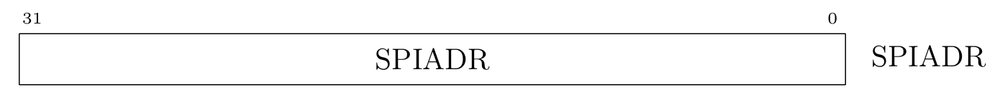

- **Bit 31:0  SPIADR: SPI Address**
When performing a read or write transfer, the SPI command is sent first, followed by the SPI address, before any data is read or written. The length of the SPI address can be controlled using the SPILEN register.

##### 2.5.5.5 SPILEN（SPI Transfer Length）

**Reset Value：0x0000_0000**


- **Bit 31:16  DATALEN: SPI Data Length**
The number of bits to be read or written. Note that the SPI command and address are first written to the SPI slave device.

- **Bit 13:8  ADDRLEN: SPI Address Length**
The number of bits for the SPI address that should be sent.

- **Bit 5:0  SPI Command Length**
The number of bits for the SPI command that should be sent.  

##### 2.5.5.6 SPIDUM（SPI Dummy Cycles）

**Reset Value：0x0000_0000**


  
- **Bit 31:16  DUMMYWR: Write Dummy Cycles**
The number of dummy cycles (no write or read) between sending the SPI command + SPI address and writing data.

- **Bit 15:0  DUMMYRD: Read Dummy Cycles**
The number of dummy cycles (no write or read) between sending the SPI command + SPI address and reading data.  


##### 2.5.5.7 TXFIFO (SPI Transmit FIFO)

**Reset Value: 0x0000_0000**


- **Bit 31:0  TX: Transmit Data**
Data to be written into the FIFO for transmission.
  

##### 2.5.5.8 RXFIFO (SPI Receive FIFO)

**Reset Value: 0x0000_0000**


- **Bit 31:0  RX: Receive Data**
Data to be read from the FIFO received during transmission.

Note: There seems to be a typo in the original text where "Transmit Data" is mentioned for both TX and RX. In the RXFIFO section, it should be "Receive Data" as corrected in the translation.   
##### 2.5.6 Checklist
  
### 2.6 SRAM
#### 2.6.1 SRAM Controller Technical Specification     

##### Description

The SRAM controller incorporates the SRAM data and address scrambling device and provides CSRs for requesting the scrambling keys and triggering the hardware initialization feature. 
In the SRAM Controller of the hw platform, we added a Scramble module (acting on data and addr) and provided CSRs (used for requesting Scramble keys and triggering hardware initialization).
[This summary draws reference from the content of the OpenTitan Hard-Ware article.](https://opentitan.org/book/hw/ip/sram_ctrl/doc/theory_of_operation.html)
This is an interpretat**ion of the hw part of the sram_ctrl code.

##### Features


- **Lightweight scrambling mechanism** based on the PRINCE cipher.
- Key request logic for the lightweight memory and address scrambling device.
- Alert sender and checking logic for detecting bus integrity failures.
- LFSR-based memory initialization feature.
- Access controls to allow / disallow code execution from SRAM.
- Security hardening when integrity error has been detected.

#### 2.6.2 Theory of Operation

This section explains how the module controls external IRAM through software analysis.


<div align=center>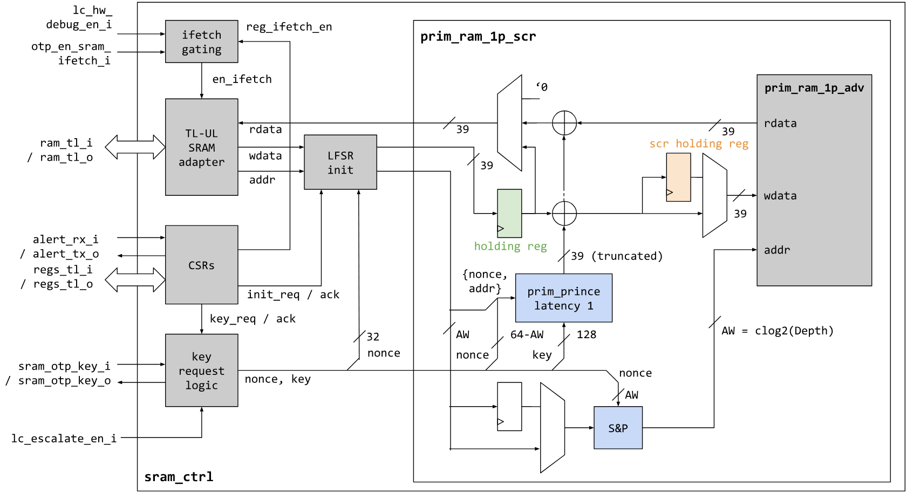  
<div>
<div align=left><div>     

The main structure is concentrated on the left side of the diagram, with a hardware instance application on the right.

It is mainly divided into the following parts:

- TL-UL SRAM Adapter;
- LFSR: Used for initialization (mechanism detailed in [1.2. Section](### 1.2. LFSR Initialization Mechanism));
- CSRs;
- Key request.

##### 2.6.2.1 How the Controller handles Integrity Errors

When encountering an **Integrity Error**, `sram_ctrl` will latch the integrity error and issue a `fatal_bus_integ_error` until the next reset (the generation of integrity errors is determined by system integration).

Additionally, the latched error condition is fed into the `prim_ram_1p_scr` primitive via a dedicated input, causing the scrambling primitive to perform the following actions:

- Invert the pseudorandom number used during address and CTR scrambling;
- Disable any transactions (read or write) to the actual memory macro.

##### 2.6.2.2 LFSR Initialization Mechanism

Since the **Scramble device** uses a block cipher in CTR mode, from a security perspective, it is undesirable to initialize the memory to all zeros (this would leak the XOR keystream).

To avoid this, `sram_ctrl` includes an LFSR-based initialization mechanism that overwrites the entire memory with pseudo-random data.

Initialization can be triggered via the `CTRL.INIT` CSR. When initialization is triggered, the LFSR is first re-seeded using the obtained random number and the scrambling key. Then, the pseudo-random data extracted from the LFSR is used to initialize the memory.

For each pseudo-random 32-bit data, the initialization mechanism calculates the corresponding integrity bits and writes the data and integrity bits (a total of 39 bits) through the scrambling device using the most recently obtained scrambling key.

If the Scrambling Key update and LFSR initialization are triggered simultaneously on the software side (i.e., the software uses the same CSR write operation as the LFSR), the LFSR initialization will be halted until the updated Scrambling Key is obtained.

There is no limit on the frequency of calls to the initialization function, so it can also be used at runtime as a cheap SRAM erase mechanism. However, note that the PRNG sequence does not have strong security guarantees, as it is generated using an LFSR.

##### 2.6.2.3. Executing Code via SRAM

>

The enable signal of the RAM ctrl is controlled by `otp_ctrl`;    
  
<div align=center>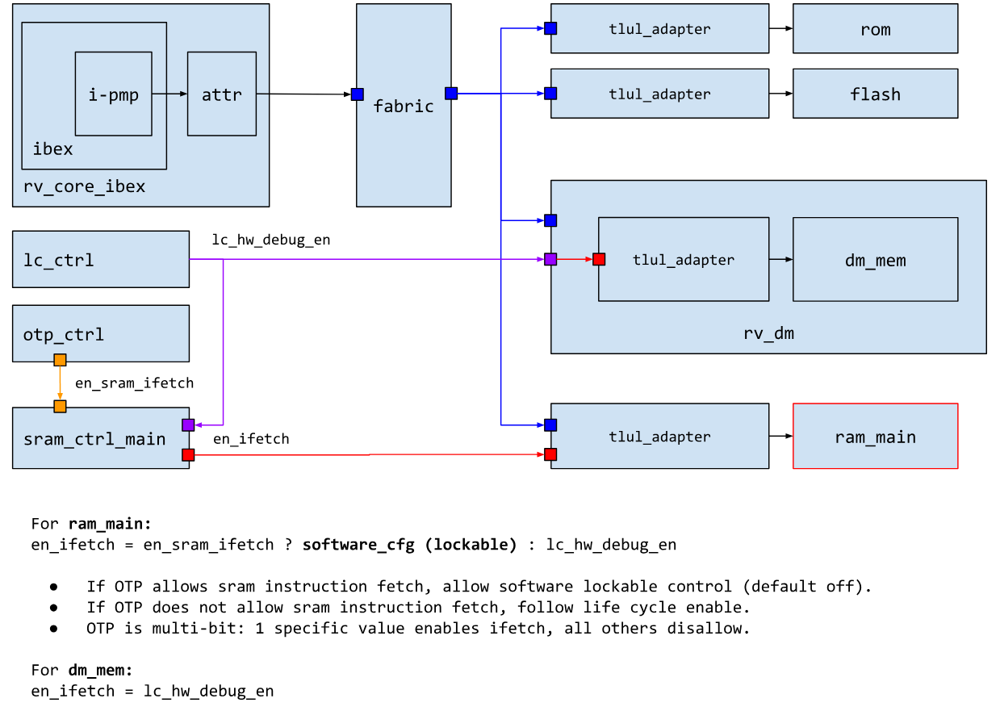  
<div>
<div align=left><div>   


##### 2.6.2.4. Read and Write Sequences

Combining the original text, the timing requirements for read and write operations are as follows:

- For timing reasons, the scrambling primitive instantiates a register in the middle of the PRINCE block cipher;
- Write operations must be delayed by 1 cycle;
- Sub-word write accesses currently require read-modify-write operations to recalculate the integrity bits of the entire word.

#### 2.6.3 Design Verification

The test plan objectives for the SRAM Controller (for dvsim) are as follows:

- Verify all SRAM_CTRL IP functionalities through dynamic simulations using SV/UVM-based test benches.
- Develop and run all tests according to the test plan to close code and functional coverage for the IP and all its submodules (excluding pre-verified submodules).
- Refer to the [OpenTitan SRAM CTRL test plan](https://opentitan.org/book/hw/ip/sram_ctrl/dv/index.html#top-level-testbench) for specific test cases.

##### Programming Guide

For software-side operational procedures, refer to the [OpenTitan SRAM CTRL software debugging guide](https://opentitan.org/book/hw/ip/sram_ctrl/doc/programmers_guide.html).

#### 2.6.4 Hardware Interfaces

This section includes parameters, signals, security signals, and handshake signal behavior with external modules (including OTP and Scramble devices). The **handshake signal behavior with external modules (including OTP and Scramble devices)** is also described in terms of software-side security measures.

#### 2.6.4.1 Parameters

| Parameter | Default | Top Earlgrey | Description |
| :-----------: | :-----------: | :-----------: | :-----------: |
| `AlertAsyncOn` | 1'b1 | 1'b1 | |
| `InstrExec` | 1 | 1 | Enable execution from SRAM side |
| `MemSizeRam` | 4096 | (multiple values) | Number of 32-bit words in SRAM (overridable by topgen) |
| `RndCnstSramKey` | (see RTL) | (see RTL) | Random default constant for Scrambling Key at compile time |
| `RndCnstSramNonce` | (see RTL) | (see RTL) | Random default constant for Scrambling Nonce at compile time |
| `RndCnstLfsrSeed` | (see RTL) | (see RTL) | Random default constant for LFSR seed at compile time |
| `RndCnstLfsrPerm` | (see RTL) | (see RTL) | Random default constants for LFSR permutation at compile time |

#### 2.6.4.2 External Signal Interfaces

The `sram_ctrl` module defines the following hardware interfaces:

- Main clock: `clk_i`
- Other clocks (OTP device): `clk_otp_i`
- Bus device interface (TL-UL): `regs_tl`, `ram_tl`
- Bus host interface (TL-UL): none
- Chip IO peripheral pins: none
- Interrupts: none

#### 2.6.4.3 Internal Signal Interfaces

| Port Name | Package::Struct | Type | Act | Width | Description |
| :-----------: | :-----------:| :-----------: | :-----------: | :-----------: | :-----------: |
| `sram_otp_key` | `otp_ctrl_pkg::sram_otp_key` | `req_rsp` | `req` | 1 | |
| `cfg` | `prim_ram_1p_pkg::ram_1p_cfg` | `uni` | `rcv` | 1 | Routine signal cfg |
| `lc_escalate_en` | `lc_ctrl_pkg::lc_tx` | `uni` | `rcv` | 1 | Global and local upgrade enable |
| `lc_hw_debug_en` | `lc_ctrl_pkg::lc_tx` | `uni` | `rcv` | 1 | |
| `otp_en_sram_ifetch` | `prim_mubi_pkg::mubi8` | `uni` | `rcv` | 1 | |
| `regs_tl` | `tlul_pkg::tl` | `req_rsp` | `rsp` | 1 | |
| `ram_tl` | `tlul_pkg::tl` | `req_rsp` | `rsp` | 1 | |

#### 2.6.4.4 Alert Signals

| Alert Name | Description |
| :----------- | :----------- |
| `fatal_error` | Triggered when a fatal TL-UL bus integrity failure or initialization mechanism reaches an invalid state. |

#### 2.6.4.5 Safety Measures

| Countermeasure ID | Description |
| :-----------: | :-----------: |
| `SRAM_CTRL.BUS.INTEGRITY` | End-to-end bus integrity scheme. |
| `SRAM_CTRL.CTRL.CONFIG.REGWEN` | SRAM control registers are protected by REGWEN. |
| `SRAM_CTRL.EXEC.CONFIG.REGWEN` | SRAM execution enable register is protected by REGWEN. |
| `SRAM_CTRL.EXEC.CONFIG.MUBI` | SRAM execution enable register is multi-bit encoded. |
| `SRAM_CTRL.EXEC.INTERSIG.MUBI` | SRAM execution enable signal from OTP is multi-bit encoded. |
| `SRAM_CTRL.LC_ESCALATE_EN.INTERSIG.MUBI` | Life cycle escalation enable signal is multi-bit encoded. |
| `SRAM_CTRL.LC_HW_DEBUG_EN.INTERSIG.MUBI` | Life cycle hardware debug enable signal is multi-bit encoded. |
| `SRAM_CTRL.MEM.INTEGRITY` | End-to-end data/memory integrity scheme. |
| `SRAM_CTRL.MEM.SCRAMBLE` | Data is scrambled using a key-reduced round PRINCE cipher in CTR mode. |
| `SRAM_CTRL.ADDR.SCRAMBLE` | Addresses are scrambled using a keyed lightweight permutation/diffusion function. |
| `SRAM_CTRL.INSTR.BUS.LC_GATED` | Prevent code execution from SRAM during non-test lifecycle states. |
| `SRAM_CTRL.RAM_TL_LC_GATE.FSM.SPARSE` | Control FSM within TL-UL gating primitive is sparse encoded. |
| `SRAM_CTRL.KEY.GLOBAL_ESC` | Scrambling key and nonce are reset to fixed values during escalation, and bus transactions to memory are blocked. |
| `SRAM_CTRL.KEY.LOCAL_ESC` | Scrambling key and nonce are reset to fixed values during local escalation due to bus integrity or counter errors, and bus transactions to memory are blocked. |
| `SRAM_CTRL.INIT.CTR.REDUN` | Initialization counter is redundant. |
| `SRAM_CTRL.SCRAMBLE.KEY.SIDELOAD` | Scrambling key is sideloaded from OTP and cannot be read by software. |
| `SRAM_CTRL.TLUL_FIFO.CTR.REDUN` | TL-UL response FIFO pointers are implemented using redundant counters. |

##### 2.6.4.5.1 Interface between OTP and SRAM Scrambling Primitives

<div align=center>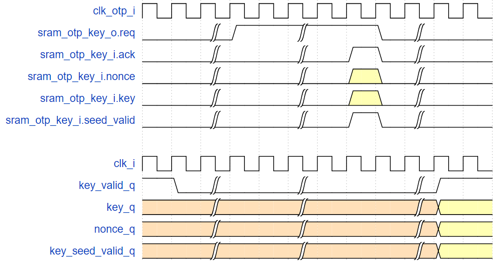  

<div>
<div align=left><div>     

- The **key derivation interface within OTP CTRL (i.e., `sram_otp_key`)** follows a simple req/ack handshake protocol.
  1. SRAM CTRL requests an updated transient key by asserting `sram_otp_key_i.req`.
  2. The OTP controller obtains the `entropy` signal from CSRNG (refer to CSRNG in hw) and derives the transient key using the **SRAM_DATA_KEY_SEED** and **PRESENT** scrambling data path (as described in the OTP controller specification).
  3. The OTP controller returns a new transient key via the response channel (`sram_otp_key_o[*]`, `otbn_otp_key_o`), completing the req/ack handshake.
- The key and nonce are available for use by the scrambling primitives in subsequent cycles. The waveform diagram illustrates this process.
- If key seeds are not configured in OTP, keys are derived from all-zero constants, and the `*.seed_valid` signal is set to 0 in the response. Note that this mechanism requires CSRNG and the entropy distribution network to be operational. If they are not, the key derivation request is blocked.
- The req/ack protocol operates on `clk_otp_i`. SRAM CTRL synchronizes the data through the req/ack handshake primitive `prim_sync_reqack.sv`.

<div align=center>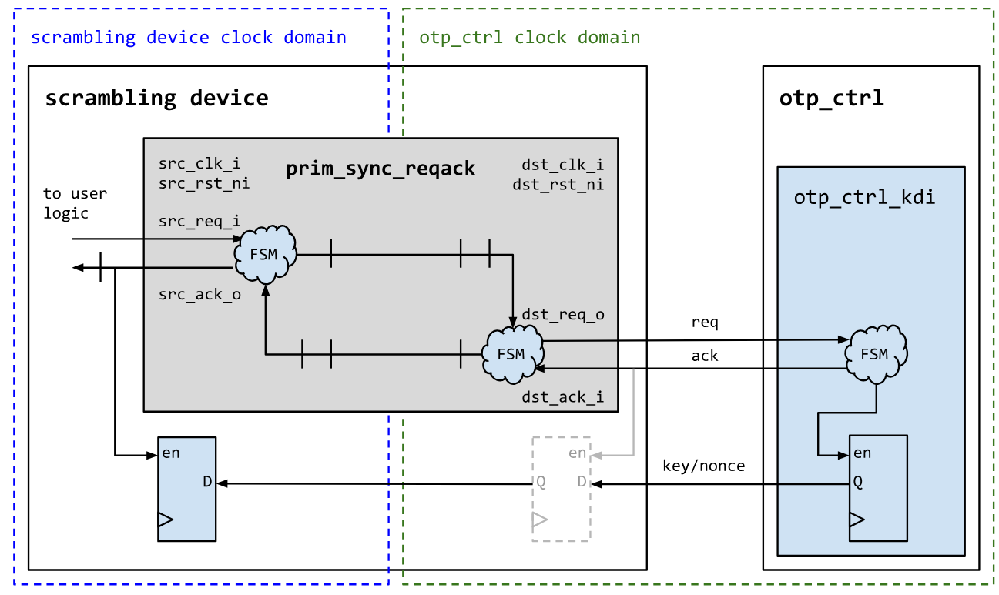  

<div>
<div align=left><div>    

##### 2.6.4.5.2 Global and Local Upgrades

This section explains the functionality of `lc_escalate_en_i`:

The `lc_escalate_en_i` signal is responsible for initiating global and local upgrades. When this signal is asserted, it triggers the system to perform necessary actions to upgrade the SRAM Controller and its associated components. This includes updating the scrambling keys, resetting counters, and ensuring the integrity of bus transactions to prevent unauthorized access or errors during the upgrade process. Global upgrades affect the entire system, while local upgrades focus on specific components, ensuring a controlled and secure update mechanism.

#### 2.6.5 Register

Detailed reading of 
[OpenTitan SRAM CTRL Register Configuration](https://opentitan.org/book/hw/ip/sram_ctrl/doc/registers.html),
here is the basic description.

Name | Offset | Length | Description
:-----------: | :-----------: | :-----------: | :-----------:
sram_ctrl.**ALERT_TEST** | 0x0 | 4 | Alert Test Register (1 bit for alert)
sram_ctrl.**STATUS** | 0x4 | 4 | SRAM Status Register (6 states; 1-bit thermal)
sram_ctrl.**EXEC_REGWEN** | 0x8 | 4 | Execution Enable Register Lock (EXEC's enable)
sram_ctrl.**EXEC** | 0xc | 4 | SRAM Execution Enable (4 bits, related to OTG function)
sram_ctrl.**CTRL_REGWEN** | 0x10 | 4 | Control Register Lock (CTRL's enable)
sram_ctrl.**CTRL** | 0x14 | 4 | SRAM Control Register (2 bits, related to OTG and LFSR control)
sram_ctrl.**SCR_KEY_ROTATED** | 0x18 | 4 | Clearable SRAM Key Request Status (4 bits, related to OTG function)


#### 2.6.6 External Interface Function

`dif_sram_ctrl.h`

#### 2.6.7 Checklist

Summary and design plan of the article. 
To understand the specific functional implementation of SRAM CTRL, it is necessary to read the **LFSR (CSRs)** and **OTP Controller** sections.


## 3. Prototype Verificaton On FPGA     
### 3.1 FPGA Development  
#### 3.1.1 FPGA Version  

<div align=center>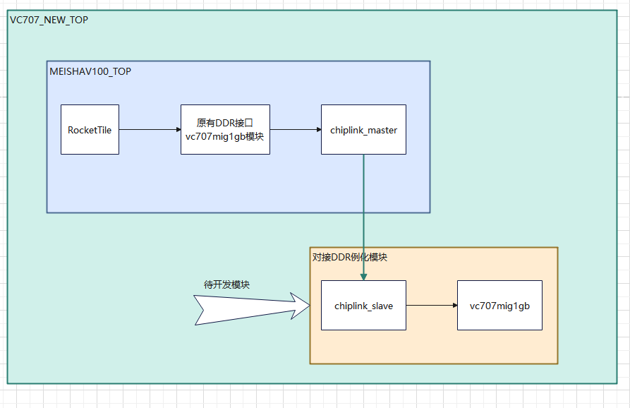  

<div>
<div align=left><div>     

#### 3.1.2 ChipLink
Reference content from [YiShengYiChip Board FPGA Development](https://ysyx.oscc.cc/chip/board/official/boards/board-3/#fpga%E5%BC%80%E5%8F%91).

**Note: When tested on VC707, Chiplink will prompt that timing requirements cannot be met when using 150Mhz and 200Mhz clocks. Actual testing shows that 150Mhz works, but 200Mhz does not!**

**Note: The address range we use for Chiplink is 0x8000_0000~0xdfff_ffff. Read and write operations in other address ranges will cause Chiplink to report a slave_err.**

#### 3.1.3 FPGA-side Block Design

<div align=center>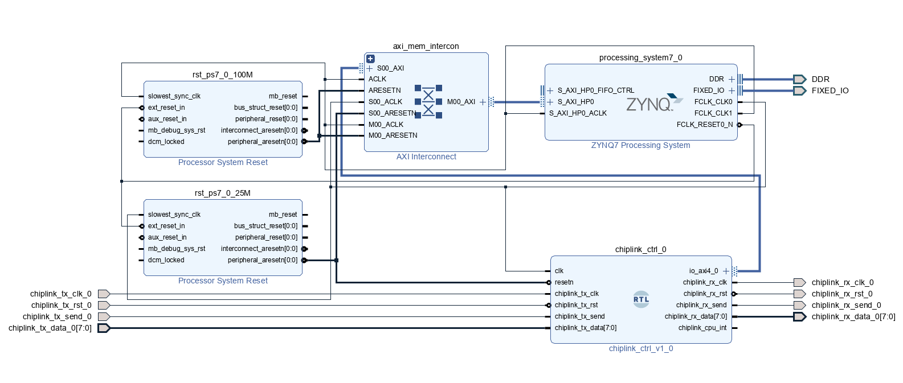  
<div>
<div align=left><div>   


- **ZYNQ7 Processing System** - PS-side processor system

  Requires the use of AXI_HP port
  
  Clock use the clock provided by the PS side, frequency as needed (Chiplink module's clock cannot use 200Mhz or higher, unable to meet timing requirements!)
  
  Pin binding as needed, for example, the ZYBO 7020 development board can refer to the example

- **AXI Interconnection** - AXI intelligent interconnect module

  Here, AXI Interconnection has two functions
  
  1. Synchronize AXI signals across clock domains, Chiplink uses a clock that is inconsistent with the DDR interface
  
  2. Convert Chiplink's AXI4 port signals to AXI3 port signals of the DDR interface
  
  The above operations are automatically completed by the AXI Interconnection module

- **Processor System Reset** - Synchronized reset module

  Regardless of whether the reset signal is a synchronous or asynchronous reset, the Block Design will give serious warnings, requiring modification of port attributes, or all use synchronous reset
  
  Therefore, Processor System Reset can be used to synchronize the reset signal to a certain clock, or a synchronized reset module can also be written (actually tested and works)

- **Chiplink** - Symmetric structure, has one master port and one slave port, two Chiplink are actually the same, only the masked ports are different when instantiated

#### 3.1.4  DDR Read and Write Test

In FPGA development, you can first verify that DDR is working normally by performing a DDR read and write test experiment on the board

In ZYNQ7020, you can complete the DDR read and write test by writing from the PL side and reading from the PS side using a serial port to print the content, specific pin assignment based on the actual situation binding

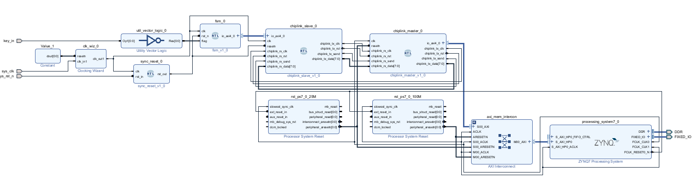  

Add a state machine to send AXI signals to write DDR, Chiplink can be added or not, mainly to verify the operation of DDR.

Verification content: Single write DDR, Burst write DDR, etc.

The principle is simple, as follows: 

<div align=center>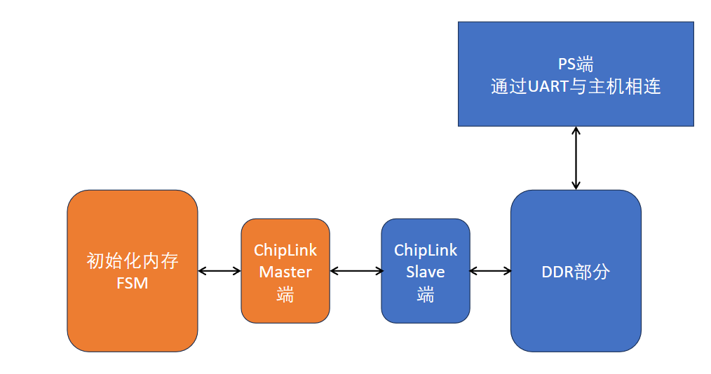  
  
<div>
<div align=left><div>   

Specific content and SDK side can refer to Altera's video and project

[65_AXI4 DDR Read and Write Test Experiment (Part 1)_bilibili](https://www.bilibili.com/video/BV11j411f7Co?p=66&vd_source=343c7823aae26537eb54d42a934d7c12)
### 3.2 Preface
#### 3.2.1 Notation Conventions
Text conventions used in the manual are specified in Table 1.

#### 3.2.2 Supported Tools and Environment Set Up
#### 3.2.2.1 SW Requirements
+ Operating environment
The project needs to run in ubuntu22.04.
+ Software dependence  
  
Firstly,following command below to git clone the project.      
`$git clone `  
  
Then Update software dependencies before downloading them.   

`$ sudo apt update`  
`$ sudo apt upgrade`                     
Then install the software dependencies.   

`$ sudo apt-get install autoconf automake autotools-dev curl libmpc-dev libmpfr-dev libgmp-dev libusb-1.0-0-dev gawk build-essential bison flex texinfo gperf libtool patchutils bc zlib1g-dev device-tree-compiler pkg-config libexpat-dev python wget`  

`$ sudo apt-get install default-jre`  
+ Install the tool chain  
Running the project also requires installing the required RISC-V toolchain for compilation on the software, the RISC-V software toolchain must be installed locally, and the $(RISCV) environment variable must be set to point to the installed RISC-V toolchain. You can start from scratch to build tool chain or at the following link to download: https://www.sifive.com/products/tools/, if you have installed the RISC-V toolchain, please run the following command.  
Note: Do not include /bin at the end of the string.     

`$ export RISCV=/home/riscv/riscv64-elf-tc`  
+ Install vivado2016.4  
This project tested can only use vivado2016.4 version to build, other newer versions will have errors.
#### 3.2.2.2 HW Requirements  
+ Supported development board  


Xilinx VC707(Virtex-7 XC7VX485T-2FFG1761C) is currently used in this project, and other types of FPGA boards have not been tested.    

### 3.3 Introduction   
The Soc built in this project was named MEISHAV100, which was built based on the freedom u500 of sifive Company, and the tilelink bus was replaced by the original pcie interface into the chiplink interface. iram, lsys, spi1 and qspi modules are added to make it have more debugging methods.    

In order to accelerate processor prototyping and provide a flexible framework for hardware/software interface validation, the FPGA prototype based on this MEISHAV100 is publicly released. This version of the open source files include Verilog source code, Vivado project, bitstream files and related documentation, so that the majority of researchers and college students can quickly learn to copy the project, and easily transplant to other models of FPGA development board.

Due to the limitation of FPGA prototype verification, the current project only includes four Rocketchip processor cores, and the clock frequency of each module has certain limitations, which cannot achieve high frequency. See Figure 1 for details.
  
### 3.4 Prototype Architecture  
#### 3.4.1 Top Level Architecture    
The overall architecture of MEISHAV100 is shown in Figure 1. In this project, MEISHAV100_TOP is the top layer of FPGA prototype verification project.
   
       
<div align=center>  
<div>
<div align=left><div>     

#### 3.4.2 Clock and Reset    

After the clock of the VC707 on-board differential clock source is converted into a single-ended clock through an IBUFDS primitive, xilinx's PLL IP core module will generate 3 CLKS, which are respectively provided to rockecttile, chiplink module and other sub. The chip is expected to support RocketTile using 1GHz clock, CHIPLINK module using 250M clock, and other modules using 500M clock, but currently in the FPGA prototype verification project, except chiplink module using 150MHz clock, other unified use 50MHz clock. Otherwise, too high a frequency will lead to timing violations.    

The top layer ResetGEN module generates multiple resets, which are respectively provided to rockecttile, chiplink module and other subs. It is expected to support the reset signal generated after RocketTile uses 1G clock to beat, and the reset signal generated after CHIPLINK module uses 250M clock to beat. The reset signal generated after other modules use the 500M clock is supported. See Figure 2 for the reset timing diagram.   
 

<div align=center>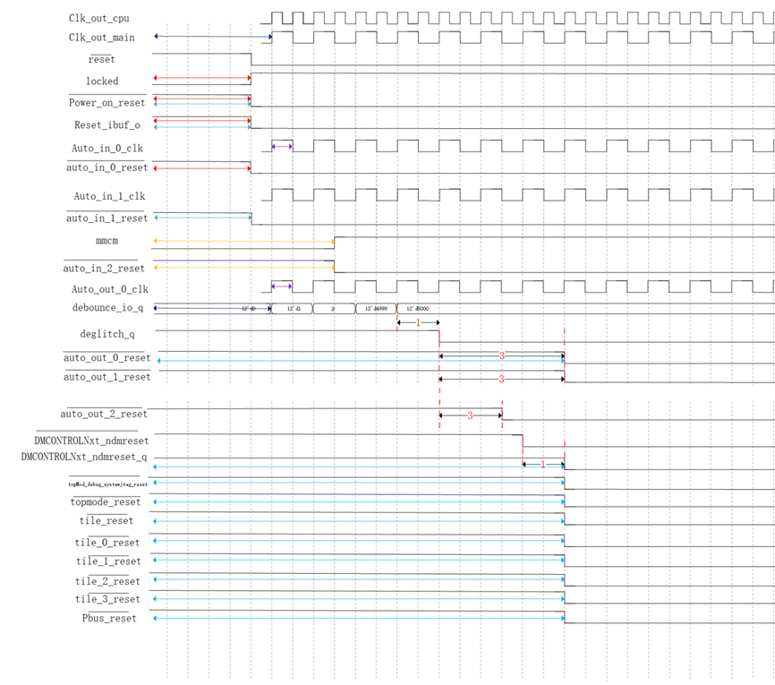    
Clock and reset time sequence diagram 
<div>
<div align=left><div>   
    

#### 3.4.3  Peripheral Architecture    
The peripherals of this project and the memory mapping of peripherals are shown below

|Base|Size|Description|Notes|    
|:-:|:-:|:-:|:-:|
|0x0000_0000|4K|debug-controller||  
|0x0000_3000|4K|error-device||  
|0x0001_0000|8K|mask rom||  
|0x0200_0000|64k|clink||  
|0x0c00_0000|4M|plic||  
|0x5000_0000|512K|on chip sram||  
|0x5100_0000|4K|soc_lsys||  
|0x5200_0000|4K|spi_1||  
|0x6000_0000|64M|timeout||  
|0x6400_0000|4K|serial|narrow or sparse is not supported|  
|0x6400_1000|4K|spi_0|narrow or sparse is not supported|  
|0x6400_2000|4K|gpio|narrow or sparse is not supported|  
|0x8000_0000|1G|DDR(CHIPLINK)||  
|0Xc000_0000|1G|timeout|this space is not accessible and access will case the bus to crash|


#### 3.4.4 Chiplink Module  
ChipLink is a low-speed interchip bus communication protocol (between FPGA and SoC) proposed by SiFive, which is mainly used for shard transmission and recombination of AXI4 requests sent by SoC to reliably access hardware logic resources on FPGA. The ChipLink controller Verilog code on the FPGA core board was generated by Chisel and has been emulated on the VCS.  
  
Tilelink bus is mainly used in this project, so it is not necessary to convert AXI request into TileLink request. Instead, TileLink request can be directly converted into Chiplink request, and then SoC signal can be transmitted to FPGA through ChipLink transmission. The FPGA side needs to combine the TileLink request according to the ChipLink protocol, then convert the TileLink request back to the AXI request through the switching bridge, and finally exchange data with the MIG IP core on the FPGA through a series of switching Bridges, so as to realize the memory access operation of DDR on the FPGA.  
  
Tested on VC707, when Chiplink uses 150MHz and 200MHz clocks, Vivado software will prompt that it cannot meet the timing requirements. However, the actual measured result is that Chiplink can still work normally at 150MHz, but not at 200MHz.  
  
Note: The address range of the Chiplink we use is from `0x8000_0000` to `0xDfff_ffff`. Reading and writing Chiplinks in other address ranges will report a slave error.  
  
### 3.5 Mapping of Main Memory  
#### 3.5.1 Using on-Board DDR3 Memory  
All currently supported development boards have DDR3 memory on it. This allows us easily implement processor main memory using Xilinx MIG 7 IP core.  
  
#### 3.5.2 Added IRAM Module    
Compared with Freedom U500, this project has added an IRAM module that can quickly access on-chip resources, mainly used to store frequently accessed stacks, hot data, hot programs, etc. The IRAM module supports axi fix and incr operation types, burst 1-16 operation types, narrow operation and sparse operation, but does not support wrap operation. Meanwhile, wstrb needs to be consistent with size, and invalid bits need to be set to 0.  
  
#### 3.5.3 SD Card as External Memory  
The SDHC Card should conform to SD specification 2.00 or later. This project is currently using Kingston's 64GB SDHC memory card and SD adapter.  
  
### 3.6 Boot mode and Serial terminal settings  
#### 3.6.1 Start-up Process  
The startup process of MEISHAV100 for this project is as follows:
  
**Power on → Run the boot program in the maskROM → Load the Linux image file bbl.bin in the SD card to the DDR → Start the Linux system**  

The bootloader program stored in maskROM mainly completes loading and starting Linux image files from SD card to DDR storage, see Section 11 for details.  

The construction of Linux image files stored in an SD card is detailed in Section 10.  
#### 3.6.2 Boot Mode Setup  
The project currently supports two startup modes, namely starting from SD card and starting from IRAM, by binding the top-level signal DEBUG_MODE_SEL to the on-board DIP switch. If the signal is 0, it starts from the SD card boot program, and if the signal is 1, it starts from IRAM.  
#### 3.6.3 Serial Terminal Setup  
Open a terminal connection from the host to the MEISHAV100 VC707 FPGA development board using programs such as Minicom or Screen on Linux, or MobaXterm on Windows. Set the parameters as shown below.  
  |Parameter|Value|  
  |:-:|:-:|  
  |Speed|115200|  
  |Parity|None|  
  |Data bits|8|  
  |Stop bits|1|  
  |Hardware Flow|None|
### 3.7 Prototype Operation
#### 3.7.1 Reset Sequence  
After reset button is pushed, the signal is converted to an internal system reset with zero active level.  
  
If there is DDR controller,system reset is used for MIG XILINX IP core first.Until the initialization signal of the DDR controller is raised, then the DDR initialization is completed. The reset signal will only be used by the core.   

#### 3.7.2 Booting OS from an SD Card  
Micro SD card allows to store both OpenBoot and OS image on it.Entering the OS with the sd card requires configured the clock frequency of uart and spi, and the default clock frequency of the processor is 50m. We have provided the pre-compiled linux systems that you can write into the sd card to run the linux system. Since you are unable to connect to the network on FPGA VC707, if you need to download the file on linux, you need to download the file into the linux system in the PC and write linux to the sd card.  
### 3.8 Simulation and Debugging  
It is possible to run software simulation of MEISHAV100 prototype from Vivado.This feature is helpful for debugging reset sequence for your project and checking initial initialization sequence of a processor. This framework can be easily extend to incorporate custom tests targeting prototype specific modules, but we leave this discussion out of scope of this documentation.
   
For debugging a processor on FPGA build-in hardware logic analyzer are used. It allows to check states of internal signals. Instructions on how to run software simulation from Vivado and how to add debug cores are below.
#### 3.8.1 Software Simulation from Vivado  
You can run simulation of a prototype from Vivado to debug initial processor initialization and warm up. Simulation from Vivado allows you to you IP cores used for synthesis and ensure that you logic is interpreted in an expected way. Top level module for simulation if fpga_top.It generates clock are reset control signals for prototype.   

+ Write tb.v file, the project has provided relatively simple simulation files, but if you have higher simulation requirements, please add the files required for the simulation  
+ Click on Tools→click on settings→click on simulation →Compile Simulation Libraries  
+ Click on simulation→Select the emulator that you wish to use.The recommended simulator to use is Vivado, as it don't need to compile simulation libraries and configure the co-simulation.    
+ In Flow Navigator on the left chose Simulation→Run behavioral Simulation. If you want to Post-Synthesis Functional Simulation, click on Functional Simulation.This requires first running the SYNTHESIS.  
#### 3.8.2  Inserting Debug Cores for Logic Analyzer  
Build-in logic analyzer allow you to debug FPGA design while  it’s running. Next steps briefly describe how to add debug cores.  
+ Find signals in the design which you want to debug. To make sure that Vivado doesn’t optimize the logic corre sponding and you will be able to access a signal with debug cores, add ( MARK_DEBUG = "TRUE" ) before it. This  directive works with flip-flops and ports, but can not work well with wires. If you need, add additional logic to flip-flop  signals.   
+ Run Synthesis of a design   
+ After synthesis finished, expand Open Synthesized Design tab of Flow Navigator and click on Set Up Debug   
+ Follow the steps in the prompt to add signals for monitoring and to assign clock domain to them   
+ Save the design and finish FPGA flow down to bitstream  generation  when programming FPGA from Vivado, in addition to .bit files specify .ltx files with debug signals names  
### 3.9  Block Design 
The prototype was validated with Xilinx's vivado2016.4 and connected to the module with its ip core via vivado's block design capabilities. The Block Design diagram is shown under:  

  
<div align=center>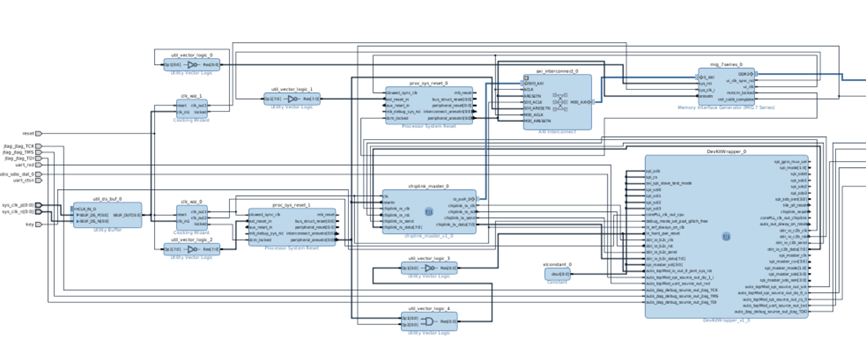  
<div>
<div align=left><div>   

 Block Design diagram  
The configurations of some ip cores are described below  
+ `Utility Buffer`: click on page0→C size:1,C BUF Type :IBUFDS
+ `clk_wiz_0`: This is the clock for processor, set the input clock to 200m, the output clock clk_out 1, clk_out 2 to 50m, and set the high level reset
+ 	`clk_wiz_1`:This is the clock for the DDR controller, set the input clock 200m, the output clock clk_out1 is 200m, set the high level reset
+ `process System Reset`:For changing the asynchronous reset of the input to a synchronous reset
+ `Axi interconnect`:The number of Master and Slave was all set at 1
+ `Memory Interface Generator`:This is the DDR controller module, used for controlling the DDR.
+ `chiplink_master`:This is the rtl code we provide, and this module allows the core to control DDR through chiplink, which can reduce the pin interface compared to the axis bus.
+ `DevKitWrapper`:This is the processor module, and some interfaces leave 0 unused because they are not used.
### 3.10 About Networking  
In this project, the PCIe interface of the original freedom U500 was replaced with a chiplink module, so MEISHAV100 could not be connected to the network for the time being. However, some bus matrices could be connected to the external chiplink interface in the future, and the MAC IP core of the FPGA board could be used to transmit network data on the bus matrix.  
### 3.11 Generating an SD-Bootable Image  
The Linux image file of this project needs to be built in ubuntu16.04 environment. In the ubuntu16.04 environment, run the following command to install and compile the required software package:   

`$ apt-get install -y build-essential git` `autotools-dev texinfo bison flex ` 
`libgmp-dev libmpfr-dev libmpc-dev gawk zlib1g-dev` `libssl-dev python unzip`
`libncurses5-dev libglib2.0-dev libpixman-1-dev` `device-tree-compiler ftp`  
`$wget cpio bc gdisk e2fsprogs vim`    
  
Then the overall sdk package this project uses the sdk package in the warehouse freedom-u-sdk. Clone the warehouse as follows:  
`$ git clone`  
https://github.com/mcd500/freedom-u-sdk.git  
`$ git checkout `  
remotes/origin/linux_u500vc707devkit_config     

After cloning, we still need to clone its sub repositories, but due to the fact that the freedom-usdk repository is too old, many of its sub repository URLs have been changed, which poses a problem of not being able to download directly using the recursive download command of the sub repository.

This project has updated the URLs of sub repositories that cannot be downloaded in the. gitmodules file. These updated. gitmodules files have been placed in the xx/xx/xx path. Please replace files in order, and execute the following command for each file replaced.  
  
The steps are as follows:  

1.Rename freedom-u-sdk.gitmodules to.gitmodules, and then replace the.gitmodules file in the freedom-u-sdk directory.  

2.Run the following commands in sequence:  
`$ git submodule sync`  
`$ git submodule update --init --recursive`  
3..Switch the sub-repository to the version specified by freedom-u-sdk.  
4.Rename qemu.gitmodules to.gitmodules and replace the.gitmodules file under freedom-u-sdk/riscv-qemu.  
5.Run the following commands in sequence:  
`$ git submodule sync`  
`git submodule update --init --recursive`  
6.Switch the sub-repository to the version specified by freedom-u-sdk.    

7.Rename toolchain.gitmodules to.gitmodules and replace the.gitmodules file under freedom-u-sdk/riscv-gnu-toolchain.  

8.Run the following commands in sequence:  

`$ git submodule sync`
`$ git submodule update --init --recursive`  

9.Switch the sub-repository to the version specified by freedom-u-sdk.  

10.Rename toolchain-qemu.gitmodules to.gitmodules, and then replace the.gitmodules file under freedom-u-sdk/riscv-gnu-toolchain/riscv-qemu.  

11.Run the following commands in sequence:
`$ git submodule sync`
`$ git submodule update --init --recursive`  

12.Switch the sub-repository to the version specified by freedom-u-sdk.  

13.Finally, the complete download of freedom-u-sdk was completed

After completing the full clone of the repository, compile and execute the Linux image:  

`$ make -j4 BOARD=vc707devkit`  

After the Linux image is compiled and generated, you can find the generated image file, that is, the bbl.bin file, under the work folder. Use the following command to burn the bbl.bin to the SD card.
`$ sudo dd  if=bbl.bin of=/dev/sdb bs=512K count=1`  

If you need to add peripherals yourself, modify the 
MEISHAV100.dts file, add the device tree of the corresponding device, and generate a dtb file to obtain driver support.  
### 3.12 Compile the ROM boot program  
The bootloader is sd.c located in the sdboot folder. Please use the gcc environment on the freedom library during compilation, otherwise an error will occur. The toolchain used is riscv64-unkown-elf-gcc. Please compile the toolchain provided by the freedom library and add the bin folder path of the toolchain to the system environment variable file.bashrc.

After modifying the sd.c file, you can use the make command in the sdboot folder to compile the sdboot.Hex file. You need to add the path of the file to the maskROM.

## 4. Backend     
### 4.1 Memory    
#### 4.1.1 Memory Technical Specification


##### Description

A shell script has been developed to automatically generate the required memory using the memory compiler tool by filling in the parameters according to the example table.  
##### Features

- Developed a script that automatically generates the required memory using the memory compiler and captures the relevant parameter information to generate a report.
- IP using UMC 40nm
- Memory selection focuses on performance (read cycles) and area

#### 4.1.2 Theory of Operation

##### 4.1.2.1 Script Functions

- Automated memory generation
- Captures memory parameters, analyses them and generates a report.

##### 4.1.2.2 Environmental requirements

###### 4.1.2.2.1 Operating system version

- Linux: any modern Linux distribution, such as Ubuntu 20.04 LTS, Fedora 34, CentOS 7, etc.
- macOS: macOS 10.15 Catalina or later.
- Other Unix-like systems: Any Unix-like system that supports Bash or other compatible shells.

###### 4.1.2.2.2 Programming language version

- Shell: Bash 4.0 or higher (the default version of Bash installed on most modern Linux distributions meets this requirement).

###### 4.1.2.2.3 Other dependencies

- A memory compiler with command line generation support.

##### 4.1.2.3 Usage Guidelines

###### 4.1.2.3.1 Not Specifying IP

By entering the parameters in the input_data.csv file (in the format of the table below) and running the . /run_memaker.sh 2 command, a report in txt format can be generated according to the parameters in the first line, which covers all satisfied parameters of memory (such as area and read time).

| proc  | type | word | bit  | byte | ringtype | cksr | datasr | load |
| :-----: | :----: | :----: | :----: | :----: | :--------: | :----: | :------: | :----: |
| fsh0l | 1P   | 64   | 21   | 4    | ringless | 0.4  | 0.4    | 0.3  |
| fsh0l | 1P   | 8192 | 8    | 8    | ringless | 0.4  | 0.4    | 0.3  |

###### 4.1.2.3.2 Specifying IP

Enter the parameters in input_ip.csv (in the form of the table below) and run the . /run_ip.sh 3 command to generate the verilog file and library file for the specified IP according to the parameters in the second line

| ip            | word | bit  | byte | mux  | ringtype | cksr | datasr | load |
| :-------------: | :----: | :----: | :----: | :----: | :--------: | :----: | :------: | :----: |
| FSH0L_B_SHLVT | 64   | 21   | 4    | 4    | ringless | 0.4  | 0.4    | 0.3  |
| FSH0L_G_SHLVT | 8192 | 8    | 8    | 8    | ringless | 0.4  | 0.4    | 0.3  |

##### 4.1.2.4 Report Output

###### 4.1.2.4.1 Not Specifying IP

- The generated report is in txt format
- The report contains the memory's aspect, area, and read cycles.
- The report also contains IP selected on the basis of minimum area and IP selected on the basis of minimum read cycles

###### 4.1.2.4.2 Specifying IP

- Generate verilog and library files based on IPs


### 4.2 I/O Cells Selections

MEISHAV100 adopts the UMC 40 nm I/O cell library. I/O cell types are selected based on specific functional characteristics and alignment with project requirements. A final section provides the pin usage of the selected I/O cells.

#### 4.2.1 I/O Cell Type Selection

I/O cells are categorized into the following types:

- analog I/O cells
- the crystal oscillator I/O cells
- tolerance generic POC I/O cells
- supports the speed requirement of the DDR2 SDRAM interface I/O cells
- supports SSTL-18,MDDR (LPDDR) and SSTL-2 modes I/O cells
- multi-voltage generic POC I/O buffer cells

This project selects I/O cells that support DDR2 SDRAM interface speeds and multi-voltage general-purpose POC I/O buffer units.

#### 4.2.2 Selection of Specific I/O Cells

The I/O cell types were determined based on pin frequency and functional requirements of the project. Pin frequencies range from 25 MHz to 300 MHz, with the need for differential clocking. Ultimately, three I/O cells were selected.

The table below lists the I/O cells selected for this project.

| cell name                                                    | function                                              | sizes               | voltage&frequency                            |
|:-------------------------: | :----------------:| :---------: |:-------------:|
| ZTRNE4GS<br />(FOH0L_QRS25_TMVH33L18<br />_GENERIC_POC_IO CELL LIBRARY) | Programmable 4.0 mA ~ 16 mA CMOS bidirectional buffer | 24.92μm x 169.4μm   | 3.3V:150MHz<br />2.5V:100MHz<br />1.8V:80MHz |
| WOSSTLECDLK<br />(FOH0L_QRS25_T18<br />_SSTL18A_IO CELL LIBRARY) | Differential bidirectional buffer                     | 70 µm x 252.98 µm   | 1.8v:supports DDR2 SRAM interface            |
| WRNE4GSLAX250<br />(FOH0L_QRS25_T18_GENERIC<br />_POC_IO_250 CELL LIBRARY SPECIFICATION) | Programmable 4.0 mA ~ 16 mA CMOS bidirectional buffer | 29.96 μm x 169.4 μm | 1.8v:250Mhz                                  |

#### 4.2.3 The truth table for I/O selection

- **ZTRNE4GSLA(WRNE4GSLAX250)**

The table below summarizes the function and specific values for each pin

| E    | Output   |
| :----: | :--------: |
| 0    | disabled |
| 1    | enabled  |

| IE   | Input    |
| :----: | :--------: |
| 0    | disabled |
| 1    | enabled  |

| SR   | Slew rate |
| :----:| :---------: |
| 0    | fast      |
| 1    | slow      |

| SMT  | input           |
| :----: | :---------------: |
| 0    | normal          |
| 1    | schmitt-trigger |

| PU   | PD   | Pull-up/Pull-down       |
| :----: | :----: | :-----------------------: |
| 0    | 0    | None                    |
| 1    | 0    | 75-kΩ pull-up           |
| 0    | 1    | 75-kΩ pull-down         |
| 1    | 1    | keeper at IE=1          |
| 1    | 1    | 75-kΩ pull-down at IE=0 |

| E8   | E4   | driving capability |
| :----: | :----: | :------------------: |
| 0    | 0    | 4*X                |
| 0    | 1    | 8*X                |
| 1    | 0    | 12*X               |
| 1    | 1    | 16*X               |

The following table represents the truth table for the selected I/O types

| I    | E    | IO          | IE   | O    |
| :----: | :----: | :-----------: | :----: | :----: |
| 0    | 1    | 0           | 1    | 0    |
| 1    | 1    | 1           | 1    | 1    |
| 0    | 1    | 0           | 0    | 0    |
| 1    | 1    | 1           | 0    | 0    |
| X    | 0    | Z           | 1    | X    |
| X    | 0    | 1           | 1    | 1    |
| X    | 0    | 0           | 1    | 0    |
| X    | 0    | pull-down   | 1    | 0    |
| X    | 0    | pull-uo     | 1    | 1    |
| X    | 0    | none/keeper | 1    | IO   |
| X    | 0    | X           | 0    | 0    |

- **WOSSTLECDLK**

The table below summarizes the function and specific values for each pin

| 信号        | 功能                                                         |
| :-----------: | :-----------------------: |
| I           | Non-inverting input signal of the driver                     |
| E           | Output enable（‘1’enabled）                                  |
| IO          | Input pad of the receiver/Output pad of the driver           |
| IOB         | Inverted input pad of the receiver/Inverted output pad of the driver |
| E3V         | VCCK power-down detection pin（‘1’enabled）                  |
| SIO         | Single-ended mode/Differential mode selection pin（‘0’differential input mode/differential output mode） |
| NLEG5~NLEG0 | NMOS driving compensation control pins（Typ.default setting：010100） |
| PLEG5~PLEG0 | PMOS driving compensation control pins（Typ.default setting：010100） |
| REF         | Reference voltage of the single-ended receiver               |
| IE          | Input enable pin（‘1’enabled）                               |
| O           | Output signal of the receiver                                |
| RONMD2~0    | Output resistance selection pin                              |
| ODTEN       | ODT enable pin（‘1’enabled）                                 |
| ODTMD2~0    | ODT resistance selection                                     |
| D15V        | I/O power selection pin（’0‘：1.2v or 1.35v     ’1‘：1.5v or 1.8v） |
| MDDR1       | MDDR mode selection pin（’0’：DDR2 mode    ‘1’：LPDDR(MDDR)mode） |

the selection of the output driver impedance

| RONMD2 | RONMD1 | RONMD0 | Description |
| :------: | :------: | :------: | :-----------: |
| 0      | 0      | 0      | 120Ω        |
| 0      | 0      | 1      | 120Ω        |
| 0      | 1      | 0      | 80Ω         |
| 0      | 1      | 1      | 60Ω         |
| 1      | 0      | 0      | Reserved    |
| 1      | 0      | 1      | 48Ω         |
| 1      | 1      | 0      | 40Ω         |
| 1      | 1      | 1      | 34.3Ω       |

On-die termination

| ODTMD2 | ODTMD1 | ODTMD0 | ODTEN | Description     |
| :------: | :------: | :------: | :-----: | :---------------: |
| X      | X      | X      | 0     | ODT is disabled |
| 0      | 0      | 0      | 1     | ODT is disabled |
| 0      | 0      | 1      | 1     | 120Ω            |
| 0      | 1      | 0      | 1     | 60Ω             |
| 0      | 1      | 1      | 1     | 40Ω             |
| 1      | 0      | 0      | 1     | Reserved        |
| 1      | 0      | 1      | 1     | 30Ω             |
| 1      | 1      | 0      | 1     | 24Ω             |
| 1      | 1      | 1      | 1     | 20Ω             |


## 5. DEVICE(SD)
###  5.1 SD Technical Specification  
#### Description
SD memory card is a new generation of memory device based on semiconductor flash memory, which is widely used in portable devices, such as digital cameras, smart phones and multimedia players, due to its excellent features such as small size, fast data transfer speed and hot-swappable.

SD cards have two communication modes, sdio and spi. The SPI mode consists of an auxiliary communication protocol provided by flash-based SD memory cards. This mode is a subset of the SD memory card protocol, and the interface is selected during the first reset command (CMD0) after power-on and cannot be changed once the device is powered on.

In the case of standard-capacity memory cards, data blocks can be as large as one card write block and as small as one byte. The card option specified in the CSD register enables partial block read/write operations.

In the case of high-capacity SD memory cards, the data block size is fixed at 512 bytes. the block length set by CMD16 is used only for CMD42 and not for memory data transfer. Therefore, partial block read/write operations are also disabled. In addition, write-protect commands (CMD28, CMD29 and CMD30) are not supported.

####  Features
- SD card verilog simulation model with spi mode (mode 0) support
- High-capacity SD memory card (SDHC) with a size of 32GB
- Operating voltage range of 2.7-3.6V
- Support card initialization, write data, read data
- Support commands including CMD0, CMD8, CMD12, CMD16, CMD17, CMD18, CMD24, CMD25, CMD55, CMD58, ACMD41 and so on.

### 5.2 Theory of Operation

####  SPI Mode

SPI messages consist of commands, responses, and data block tokens. All communication between the host and the card is controlled by the host. The host initiates each bus process by setting the CS signal low.

The selected card always responds to commands, and when the card encounters a data retrieval problem during a read operation, it responds with an error response (replacing the expected block of data) rather than a timeout as in SD mode.

In addition, each data block sent to the card during a write operation will respond with a data response token.

#### Power-on

The state machine st waits 74 clock cycles in the PowerOn state and switches to the IDLE state when power-on is complete.

#### Receiving Commands

When a 48-bit command is transmitted on the mosi line, he first two bits 0x01 of the command is recognised and the state machine st switches from IDLE to CmdBit46 and then to CommandIn to receive the next 46 bits of data.

####  Responding to Commands

The state machine st receives the command in the CommandIn state and switches to CardResponse state, in which it responds to the command invocation function and the response is sent to the miso line.

After the response is sent the state machine st jumps to the corresponding state to complete the wait or read/write data operation according to the previously received command.

####  Card Initialisation

Use state machine ist to respond to initialisation commands and set init_done to 1 when the commands have all completed.

####  Clock and Phase

A maximum clock of 400KHz is required in Card Idntification Mode.
A maximum clock of 25MHz is required in Data Transfer Mode.

The SPI device module only internally supports mode 0, where data is shifted out on the falling edge and sampled on the rising edge.

The SPI device module internally supports mode 0, in which data is shifted out on the falling edge and sampled on the rising edge, and the SPI clock returns high at the end of the transaction.

### 5.3 SD Card Design Verification
#### Goals
##### DV
 Verify SD card features by running dynamic simulations with a SV/UVM based testbench  
#### Design features  
For detailed information on UART design features, please see the **SD Technical Specification**.    
##### Testbench architecture  
###### Top level testbench

The top-level testbed is located in ‘\trunk\hw\d2dv100_top\dv’ and the SD card model is instantiated in dut_MEISHAV100_TOP_wrapper.sv.

| SD card signals | SD card signals given by the top-level module |  I/O   |
| :-------------: | :-------------------------------------------: | :----: |
|      sclk       |                    spi_clk                    | output |
|      mosi       |                     MOSI                      | output |
|      miso       |                     MISO                      | input  |
|       ncs       |                     SS_n                      | output |
|      rstn       |                   spi_rst_n                   | output |

####  Stimulus strategy

This test was modified based on the sd.c code written for the Freedom U500.

####  Self-checking strategy

Provide the spi port on the soc to send data to the spi-slave to see if the spi-slave can send back the correct value.

In the main function, send data to spi_txfifo via REG32(spi, SPI_REG_TXFIFO), then the spi will automatically send the data from the txfifo, and we only need to check if the mosi port is correctly outputting in the monitor. Since the txfifo can only send one byte of data at a time, choosing 0x00~0xff as the test data will cover all cases.

#### 5.3.1 Testplan
##### 5.3.1.2 SD card initialisation test
The SD card needs to be initialised before performing data read and write operations.
 **Power-on and clock pulse sending**:  

   - After the SD card is powered on, the host needs to send at least 74 clock pulses to the SD card. This is because the SD card needs about 64 clock cycles to reach the normal operating voltage, after which 10 clock cycles are used to synchronise with the SD card.
   - During this time, the chip select signal ncs and the master output slave input signal mosi should be held high.  
    
**Send CMD0 command**:  

   - The chip select signal ncs is pulled low and the CMD0 (0x40) command is sent to the SD card with parameters 0x00_00_00_00_00 and CRC check bit 0x95.
   - This command is used to reset the SD card. After the command is sent, wait for the SD card to return the response data R1.  
    
**Check CMD0 response:**  

   - Check the returned response data R1. If R1 is 0x01, it indicates that the SD card is in idle state and you can enter SPI mode and continue to the next step. If R1 is any other value, you need to re-execute step 2.
   - Wait for 8 clock cycles and then pull up the chip select signal ncs.  
    
**Send CMD8 command**:  

   - Pull down the chip select signal ncs again and send CMD8 (0x48) command with parameter 0x00_00_01_AA.
   - This command is used to query the version number of the SD card. After the command is sent, wait for the SD card to return the response data R7.  
 
**Check CMD8 response**:  

   - Check the returned response data. If R1 is 0x05, the SD card is not an SD 2.0 card. If R1 is 0x01 and the 32-bit parameter is 0x00_00_01_AA, it is judged to be an SD 2.0 card. If the returned data is incorrect, step 4 needs to be performed again.
   - Wait for 8 clock cycles and pull up the chip select signal ncs.  
      
  
**Sends APP_CMD (CMD55), the precursor command to the ACMD41 command**:  
   - Pull down the chip select signal ncs and send CMD55 (0x77) command to inform the SD card that the next send is a application-specific command.
   - Wait for the SD card to return the response data R1, check if R1 is 0x01. if yes, continue to the next step; if no, re-execute step 6.  
      
**Send ACMD41 command**:  

   - Pull down the chip select signal ncs and send the ACMD41 (0x69) command to query the SD card initialisation result.
   - Wait for SD card to return response data R1.  
  
**Check ACMD41 response**:  

   - Check R1 in the returned response data R3. if R1 is 0x00, initialisation is complete. If not, it is necessary to re-execute step 6 until the initialisation is successful.
   - Wait for 8 clock cycles and then pull up the chip select signal ncs.

The above steps outline the initialisation process for SD 2.0 specification SD cards, ensuring that the SD card has been correctly initialised prior to data reading and writing.3.5.2

##### 5.3.1.3 SD card data write test

After the initialisation of the SD card is completed, the data writing operation is performed first, and then the written data is read out and verified.

###### 5.3.1.3.1 Single Block Write Operation  
  
 **Send Write Command**:
   - Pull down the chip select signal ncs.
   - Send the CMD24 command (0x58) to the SD card, carrying the 4-byte SD card write sector address as a parameter.
   - The CRC check byte is not used and is written directly to 0xAA.
   - After the command is sent, wait for the SD card to return the response data.  
    
**Check response and write data**:
   - If the SD card returns the correct response data R1 is 0x00, wait 8 clock cycles.
   - Write token 0xFE to the SD card, immediately followed by a 512-byte block of data.  
  
**Write CRC**:
   - In SPI mode, no CRC check is performed on the data, and two bytes of 0xFF are written directly as the CRC check byte.  
  
**Waiting for SD card response**:
   - After the verification data is sent, the SD card returns the response data.
   - The SD card then pulls the MISO signal low and enters the write busy state.  
  
**Write operation complete**:
   - Wait for the MISO signal to be pulled high again to indicate that the SD card exits the write busy state.
   - Wait for 8 clock cycles and then pull up the chip select signal ncs.
   - At this point, the SD card data write operation is complete and other operations can be performed.

###### 5.3.1.3.2 Multiple Block Write Operation

**Send write command**:
   - Pull down the chip select signal ncs.
   - Send a CMD25 command (0x59) to the SD card, carrying the 4-byte SD card write sector address as a parameter.
   - The CRC check byte is not used and is written directly to 0xAA.
   - After the command is sent, wait for the SD card to return the response data.  
    
 **Check response and write data**:
   - If the SD card returns the correct response data R1 is 0x00, wait for 8 clock cycles.
   - Write token 0xFC to the SD card, immediately followed by a 512-byte block of data.  
   
 **Write CRC check byte**:
   - In SPI mode, no CRC check is performed on the data, and two bytes of 0xFF are written directly as the CRC check byte.  
  
**Wait for SD card response**:
   - After the check data is sent, the SD card will return the response data.
   - The SD card then pulls the MISO signal low and enters the write busy state.  
  
 **Continue to send data block**:
   - Wait for the MISO signal to pull high again to indicate that the SD card exits the write busy state.
   - Write token 0xFC to the SD card, immediately followed by a 512-byte data block.  

**Write CRC check byte**:
   - In SPI mode, no CRC check is performed on the data, and two bytes of 0xFF are written directly as the CRC check byte.  
  
 **Wait for SD card response**:
   - After the check data is sent, the SD card will return the response data.
   - The SD card then pulls the MISO signal low and enters the write busy state.  
    
**Write operation complete**:
   - Wait for the MISO signal to pull high again to indicate that the SD card exits the write busy state.
   - Send the write end token 0xFD.
   - Wait for 8 clock cycles and then pull up the chip select signal ncs.
   - At this point, the SD card data write operation is complete and other operations can be performed.

The above steps outline the process of SD card data writing to ensure that the data can be correctly written to the specified sectors of the SD card, and to perform the necessary status checks after the writing is complete.

##### 5.3.1.4 SD card data reading test

After the SD card has been initialised and data written, the operation of reading and verifying the data is performed next.

##### 5.3.1.4.1 Single Block Read Operation

 **Send read command**:
   - Pull down the chip select signal ncs.
   - Send the CMD17 command (0x51) to the SD card, carrying the 4-byte SD card read sector address as a parameter.
   - The CRC check byte is not used and is written directly to 0xFF.
   - After the command is sent, wait for the SD card to return the response data.  
      
 **Check the response and read the data**:
   - If the SD card returns the correct response data R1 is 0x00, prepare to receive the data using the data header 0xFE returned by the SD card as a flag.
   - Receive 512 bytes of data read from SD card and 2 bytes of CRC check byte.  
    
 **Parsing data**:
   - After confirming data token 0xFE, receive 512 bytes of data returned from SD card.
   - After data parsing is completed, receive two bytes of CRC check value. In SPI mode, no CRC check is performed on the data, so these two bytes can be ignored.  
   
**Read operation complete**:
   - After the CRC check byte is received, wait for 8 clock cycles.
   - Pulling up the chip select signal ncs marks the completion of a data read operation.

##### 5.3.1.4.2 Multiple Block Read Operation

  
**Send read command**:
   - Pull down the chip select signal ncs.
   - Send the CMD18 command (0x52) to the SD card, carrying the 4-byte SD card read sector address as a parameter.
   - The CRC check byte is not used and is written directly to 0xFF.
   - After the command is sent, wait for the SD card to return the response data.
  
 **Check the response and read the data**:
   - If the SD card returns the correct response data R1 is 0x00, prepare to receive the data using the data token 0xFE returned by the SD card as a flag.
   - Receive 512 bytes of data read from SD card and 2 bytes of CRC check byte.
  
 **Parsing data**:
   - After confirming data token 0xFE, receive 512 bytes of data returned from SD card.
   - After data parsing is completed, receive two bytes of CRC check value. In SPI mode, no CRC check is performed on the data, so these two bytes can be ignored.
  
**Interrupt reading**:
   - Send the abort command cmd12 (0x4c), the abort command can be sent at any time, when 512 bytes are sent, stop sending data.
   - If cmd12 is not sent, it will continue to read the next data block.
  
 **Read operation completed**:
   - After the CRC check byte is received, wait for 8 clock cycles.
   - Pull up the chip select signal ncs to mark the completion of a data read operation.

The above steps ensure that the previously written data is correctly read from the SD card and the necessary verification is performed.

### 5.4 Hardware Interfaces

#### 5.4.1 SD card I/O

| Pin name | Direction |                       Description                        |
| :------: | :-------: | :------------------------------------------------------: |
|   sclk   |   input   |                      SD Card Clock                       |
|   ncs    |   input   |                    chip select signal                    |
|   mosi   |   input   |  SD card input, host sends commands and data to SD card  |
|   miso   |  output   | SD card output to send data or response to host computer |

### 5.5 Registers

|   Name    | Offset | bit width |                         Description                          |
| :-------: | :----: | :-------: | :----------------------------------------------------------: |
|    csd    |   \    |    128    | The CSD is card-specific data register that provides information. |
|    cid    |   \    |    128    | The CID (Card Identification) register contains the card identification information. The value of the CID register is vendor specific. |
|    ocr    |   \    |    32     | This register describes the operating voltage range and status bit in the power supply.This model is SDHC with a voltage range of 2.7-3.6V |
|    scr    |   \    |    64     | SCR (SD Card Configuration Register) provides information on the SD memory card’s special features. |
|    st     |  0x0   |     4     |               Record SD card state transitions               |
|    ist    |  0x0   |     3     |  Recording state transitions during SD card initialisation   |
| init_done |  0x0   |     1     |                Initialisation completion flag                |
|   token   |  0x0   |     8     |          Record the start token for receiving data           |
| multi_st  |  0x0   |     2     | State machine for continuous data writing, implementation of interrupt commands |

##### two-dimensional array

|   Name    | bit width |      bit depth       |                       Description                        |
| :-------: | :-------: | :------------------: | :------------------------------------------------------: |
| flash_mem |     8     | 32\*1024\*1024\*1024 | Simulates the data storage area of an SD card, size 32GB |

### 5.6 Checklist

#### Design

| Command   | Result |
| :---------: | :------: |
| cmd0      | done   |
| cmd1      | waived |
| cmd6      | waived |
| cmd8      | done   |
| cmd9      | done   |
| cmd10     | done   |
| cmd12     | done   |
| cmd13     | waived |
| cmd16     | done   |
| cmd17     | done   |
| cmd18     | doen   |
| cmd24     | done   |
| cmd25     | done   |
| cmd27     | waived |
| cmd28     | waived |
| cmd29     | waived |
| cmd30     | waived |
| cmd32     | waived |
| cmd33     | waived |
| cmd38     | waived |
| cmd42     | waived |
| cmd55     | done   |
| cmd56     | waived |
| cmd58     | done   |
| cmd59     | waived |
| acmd13    | done   |
| acmd18    | waived |
| acmd22    | waived |
| acmd23    | waived |
| acmd25    | waived |
| acmd26    | waived |
| acmd38    | waived |
| acmd41    | done   |
| acmd42    | waived |
| acmd43-49 | waived |
| acmd51    | done   |

#### Verify

| Command   | Result    |
| :---------: | :---------: |
| cmd0      | done      |
| cmd1      | waived    |
| cmd6      | waived    |
| cmd8      | done      |
| cmd9      | not start |
| cmd10     | not start |
| cmd12     | done      |
| cmd13     | waived    |
| cmd16     | done      |
| cmd17     | done      |
| cmd18     | doen      |
| cmd24     | done      |
| cmd25     | done      |
| cmd27     | waived    |
| cmd28     | waived    |
| cmd29     | waived    |
| cmd30     | waived    |
| cmd32     | waived    |
| cmd33     | waived    |
| cmd38     | waived    |
| cmd42     | waived    |
| cmd55     | done      |
| cmd56     | waived    |
| cmd58     | done      |
| cmd59     | waived    |
| acmd13    | not start |
| acmd18    | waived    |
| acmd22    | waived    |
| acmd23    | waived    |
| acmd25    | waived    |
| acmd26    | waived    |
| acmd38    | waived    |
| acmd41    | done      |
| acmd42    | waived    |
| acmd43-49 | waived    |
| acmd51    | not start |


